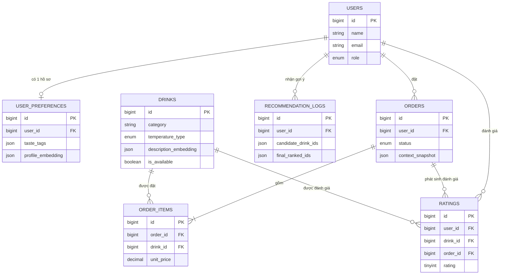

# Database Documentation — Smart Drink Recommendation App

> Tài liệu này mô tả chi tiết thiết kế cơ sở dữ liệu (schema) cho hệ thống đặt đồ uống thông minh có gợi ý cá nhân hoá. Đây là tài liệu **thiết kế** (design doc), dùng làm nguồn tham chiếu khi viết migration Laravel thực tế tại `backend/database/migrations/`.
>
> Nguồn nghiệp vụ gốc: [`SPEC_smart-drink-recommendation-app.md`](../SPEC_smart-drink-recommendation-app.md) (mục 2.2 — Thiết kế cơ sở dữ liệu).

---

## 1. Tổng quan

Hệ thống dùng **MySQL** làm database chính, **Redis** làm cache layer (không phải nguồn dữ liệu bền vững). Vector embedding (dùng cho gợi ý bằng OpenAI Embeddings) được lưu trực tiếp trong MySQL dưới dạng cột `JSON`, cosine similarity được tính ở tầng ứng dụng (PHP/Laravel), **không dùng vector DB riêng** (pgvector, Pinecone, v.v.) vì quy mô đồ án nhỏ.

Schema xoay quanh 3 luồng nghiệp vụ chính:

1. **Hồ sơ người dùng & sở thích** (`users`, `user_preferences`) — nền tảng cho việc cá nhân hoá.
2. **Menu & đặt hàng** (`drinks`, `orders`, `order_items`) — luồng giao dịch lõi.
3. **Phản hồi & gợi ý** (`ratings`, `recommendation_logs`) — vòng lặp feedback giúp cải thiện chất lượng gợi ý theo thời gian.

Ngoài 7 bảng nghiệp vụ trên, Laravel còn tự sinh một số bảng hệ thống (framework-managed) không thuộc phạm vi tài liệu này — xem [mục 7](#7-bảng-hệ-thống-do-laravel-quản-lý).

---

## 2. Cấu trúc thư mục

```
doc/database/
├── README.md                  # Tài liệu tổng quan (file này)
├── DATABASE_SCHEMA.md         # Tổng quan tất cả bảng: mục đích, cấu trúc, dữ liệu mẫu
└── tables/                    # Chi tiết thiết kế từng bảng + ghi chú
    ├── users.md
    ├── user_preferences.md
    ├── drinks.md
    ├── orders.md
    ├── order_items.md
    ├── ratings.md
    └── recommendation_logs.md
```

Cách đọc tài liệu:

- Muốn có cái nhìn tổng quan nhanh (danh sách bảng, cột, mẫu dữ liệu) → đọc `DATABASE_SCHEMA.md`.
- Muốn hiểu sâu 1 bảng cụ thể (index, ràng buộc, business rule, lý do thiết kế) → đọc file tương ứng trong `tables/`.
- Muốn hiểu bối cảnh nghiệp vụ đầy đủ (use case, API, luồng gợi ý) → đọc `SPEC_smart-drink-recommendation-app.md` trong thư mục `doc/`.

---

## 3. Data Flow — Luồng dữ liệu giữa các bảng

### 3.1. Sơ đồ quan hệ (ERD)



### 3.2. Luồng "Khai báo & cập nhật sở thích" (UC-02)

```
User submit form sở thích
      │
      ▼
UserPreference (taste_tags, sugar_level_default, ice_level_default, allergy_notes)
      │  ghép thành profile_text
      ▼
UpdateUserProfileEmbeddingJob (queued)
      │  gọi OpenAI Embeddings (text-embedding-3-small)
      ▼
UserPreference.profile_embedding (JSON vector) được cập nhật
```

`profile_text` được ghép lại (và job embedding được trigger lại) mỗi khi:
- User cập nhật preferences trực tiếp, **hoặc**
- User gửi rating mới (UC-07) — lịch sử đánh giá là input "implicit" cho hồ sơ sở thích (FR1).

### 3.3. Luồng "Đặt hàng" (UC-05)

```
Order (status=pending, context_snapshot chụp lại ngữ cảnh lúc đặt)
  │
  ├── OrderItem (drink_id, quantity, sugar_level, ice_level, unit_price snapshot, subtotal)
  ├── OrderItem ...
  ▼
total_price = Σ(order_items.subtotal)
```

`context_snapshot` lưu lại {giờ, thời tiết, nhiệt độ, occasion} tại thời điểm đặt — phục vụ phân tích sau này (VD: "khách hay đặt trà đào lúc trời nóng buổi chiều").

### 3.4. Luồng "Gợi ý cá nhân hoá" (UC-04, mục 2.4 SPEC)

```
GET /api/recommendations?lat=&lon=
      │
      ▼
WeatherService → context_object {hour, weather, temperature}
      │
      ▼
Pre-filter DRINKS (is_available=true + điều kiện ngữ cảnh, VD temperature_type)
      │
      ▼
Lấy USER_PREFERENCES.profile_embedding (cache sẵn)
      │
      ▼
Cosine similarity (PHP) giữa profile_embedding và từng DRINKS.description_embedding
      │  → sắp xếp giảm dần, lấy top 10
      ▼
Gọi gpt-4o-mini re-rank + sinh giải thích → top 5
      │
      ▼
Ghi RECOMMENDATION_LOGS (context_snapshot, candidate_drink_ids, final_ranked_ids, llm_explanation)
      │
      ▼
Trả kết quả cho Frontend
```

### 3.5. Luồng "Đánh giá món" (UC-07) — vòng lặp feedback

```
User gửi rating cho 1 drink trong 1 order đã done
      │
      ▼
RATINGS (user_id, drink_id, order_id, rating, comment)
      │
      ▼
UpdateUserProfileEmbeddingJob (queued) — cập nhật lại profile_text + profile_embedding
      │
      ▼
Vòng lặp: rating mới ảnh hưởng đến gợi ý tương lai (FR1)
```

---

## 4. Danh sách bảng dữ liệu

| Bảng | Mục đích | Chi tiết |
|---|---|---|
| `users` | Tài khoản, phân biệt Customer/Admin | [tables/users.md](tables/users.md) |
| `user_preferences` | Hồ sơ sở thích (explicit + embedding) — 1-1 với `users` | [tables/user_preferences.md](tables/user_preferences.md) |
| `drinks` | Menu đồ uống + embedding mô tả món | [tables/drinks.md](tables/drinks.md) |
| `orders` | Đơn hàng + snapshot ngữ cảnh lúc đặt | [tables/orders.md](tables/orders.md) |
| `order_items` | Chi tiết từng món trong đơn hàng | [tables/order_items.md](tables/order_items.md) |
| `ratings` | Đánh giá/feedback của user cho món đã uống | [tables/ratings.md](tables/ratings.md) |
| `recommendation_logs` | Log mỗi lượt gợi ý (để đánh giá chất lượng sau này) | [tables/recommendation_logs.md](tables/recommendation_logs.md) |

Xem bảng tổng hợp đầy đủ cột + dữ liệu mẫu tại [`DATABASE_SCHEMA.md`](DATABASE_SCHEMA.md).

---

## 5. Nguyên tắc thiết kế

1. **Đặt tên**: `snake_case` cho tên bảng và cột (đúng convention Laravel), tên bảng số nhiều (`drinks`, `orders`...).
2. **Khoá chính**: mọi bảng dùng `id BIGINT UNSIGNED AUTO_INCREMENT` (Laravel `$table->id()`).
3. **Timestamps**: mặc định dùng cặp `created_at`/`updated_at` (Laravel `$table->timestamps()`) cho mọi bảng có thể thay đổi theo thời gian, **trừ** `recommendation_logs` — bảng log mang tính **append-only/immutable**, chỉ có `created_at`, không có `updated_at` (đúng theo SPEC).
4. **Dữ liệu bán cấu trúc (semi-structured)**: dùng cột `JSON` (không dùng `LONGTEXT` thô) cho các trường: `taste_tags`, `tags`, `context_snapshot`, `candidate_drink_ids`, `final_ranked_ids`, `profile_embedding`, `description_embedding`. Lý do chọn `JSON` thay vì `LONGTEXT`: MySQL validate cú pháp JSON tự động, hỗ trợ hàm `JSON_EXTRACT`/`->` khi cần debug/query nhanh, trong khi vẫn đơn giản như `LONGTEXT` khi chỉ đọc/ghi nguyên khối ở tầng ứng dụng.
5. **Vector embedding**: lưu dạng mảng số thực JSON (`[0.0123, -0.045, ...]`, 1536 chiều với `text-embedding-3-small`). Không tính lại embedding nếu dữ liệu nguồn (`profile_text` / `name+ingredients+tags`) không đổi (FR6) — quản lý qua queued Jobs (`UpdateUserProfileEmbeddingJob`, `UpdateDrinkEmbeddingJob`).
6. **Snapshot dữ liệu tại thời điểm giao dịch**: `orders.context_snapshot` và `order_items.unit_price`/`subtotal` lưu lại giá trị **tại thời điểm phát sinh giao dịch**, độc lập với dữ liệu hiện tại của `drinks`/thời tiết — đảm bảo lịch sử đơn hàng không bị "trôi" khi dữ liệu gốc thay đổi sau này.
7. **Soft delete cho `drinks`**: dùng `deleted_at` (Laravel `SoftDeletes`) thay vì xoá cứng, để không phá vỡ khoá ngoại từ `order_items`/`ratings` khi Admin xoá món đã từng được đặt/đánh giá. Việc **ẩn món khỏi menu/gợi ý** dùng cờ `is_available = false` (độc lập với soft delete — 1 món có thể `is_available=false` mà chưa bị xoá, hoặc bị xoá hẳn).
8. **Ràng buộc khoá ngoại (Foreign Key)**:
   - `user_preferences.user_id → users.id` — `ON DELETE CASCADE` (hồ sơ sở thích phụ thuộc hoàn toàn vào user, xoá user thì xoá luôn).
   - `orders.user_id → users.id`, `ratings.user_id → users.id`, `ratings.drink_id/order_id`, `order_items.order_id` — `ON DELETE RESTRICT` (không cho xoá user/drink/order nếu còn dữ liệu giao dịch/đánh giá tham chiếu tới, bảo toàn dữ liệu tài chính & lịch sử) ngoại trừ `order_items.order_id → orders.id` dùng `ON DELETE CASCADE` (xoá đơn thì xoá luôn các dòng chi tiết của đơn đó).
   - `order_items.drink_id → drinks.id` — `ON DELETE RESTRICT` (kết hợp với soft delete ở trên để không bao giờ mất tham chiếu).
9. **Ràng buộc duy nhất (Unique)**:
   - `users.email` — unique.
   - `user_preferences.user_id` — unique (đảm bảo quy tắc nghiệp vụ "1 user chỉ có 1 hồ sơ sở thích").
   - `ratings (user_id, order_id, drink_id)` — unique (1 user chỉ đánh giá 1 lần cho 1 món trong 1 đơn hàng cụ thể; muốn sửa đánh giá thì `UPDATE`, không tạo dòng mới).
10. **Enum vs. string tự do**: dùng `ENUM` cho các trường có tập giá trị cố định, ít thay đổi (`orders.status`, `drinks.temperature_type`, `sugar_level`, `ice_level`). Dùng `VARCHAR` tự do cho `drinks.category` vì danh mục món có thể mở rộng linh hoạt theo thực đơn quán mà không cần sửa schema.
11. **Chỉ mục (Index)**: đánh index cho mọi cột dùng để filter/join thường xuyên: `drinks.category`, `drinks.is_available`, `drinks.temperature_type`, `orders.status`, `orders.user_id`, `order_items.order_id`, `order_items.drink_id`, `ratings.drink_id`, `recommendation_logs.user_id`.
12. **Phân quyền Admin/Customer**: bổ sung cột `users.role ENUM('customer','admin')` (không có trong bảng mô tả gốc ở SPEC mục 2.2, được bổ sung sau khi xác nhận với người yêu cầu) để phân biệt 2 actor Customer/Admin nêu ở mục 1.1 SPEC, tránh phải tạo thêm bảng `admins` riêng ngoài phạm vi SPEC.

---

## 6. Migration

Migration Laravel thực tế nằm ở `backend/database/migrations/`. Tài liệu này là **nguồn thiết kế** để hiện thực hoá các migration đó; tại thời điểm viết tài liệu, các migration nghiệp vụ đã được tạo **khung sườn** nhưng chưa có đầy đủ cột — cần bổ sung cột theo đúng chi tiết trong `tables/*.md`:

| Bảng | File migration hiện có |
|---|---|
| `users` | `0001_01_01_000000_create_users_table.php` |
| `user_preferences` | `2026_08_26_040215_create_user_preferences_table.php` |
| `drinks` | `2026_08_26_040216_create_drinks_table.php` |
| `orders` | `2026_08_26_040217_create_orders_table.php` |
| `order_items` | `2026_08_26_040218_create_order_items_table.php` |
| `ratings` | `2026_08_26_040219_create_ratings_table.php` |
| `recommendation_logs` | `2026_08_26_040220_create_recommendation_logs_table.php` |

Thứ tự migration phải tôn trọng khoá ngoại: `users` → `user_preferences` / `drinks` → `orders` → `order_items` → `ratings` → `recommendation_logs` (thứ tự file hiện tại theo timestamp đã đúng thứ tự này).

Lệnh chạy migration (từ thư mục `backend/`, hoặc qua container theo `Makefile`/`docker-compose` của repo):

```bash
php artisan migrate          # áp dụng migration
php artisan migrate:rollback # rollback lần migrate gần nhất
php artisan migrate:fresh --seed  # xoá sạch DB, tạo lại + seed dữ liệu mẫu
```

Seeder tương ứng nên đặt tại `backend/database/seeders/` (đã có sẵn `DatabaseSeeder.php`), nên bổ sung factory/seeder cho `drinks` (dữ liệu menu mẫu) để phục vụ phát triển & demo.

---

## 7. Bảng hệ thống do Laravel quản lý

Ngoài 7 bảng nghiệp vụ, các bảng sau được Laravel/Sanctum/Queue tự sinh, **không thuộc phạm vi thiết kế nghiệp vụ** của tài liệu này (không có file chi tiết riêng trong `tables/`):

| Bảng | Mục đích | Nguồn |
|---|---|---|
| `password_reset_tokens` | Token đặt lại mật khẩu | Laravel Auth mặc định |
| `sessions` | Phiên đăng nhập (nếu dùng session driver) | Laravel mặc định |
| `cache`, `cache_locks` | Cache driver dùng DB (thường thay bằng Redis theo SPEC) | Laravel Cache |
| `jobs`, `job_batches`, `failed_jobs` | Hàng đợi cho `UpdateDrinkEmbeddingJob`, `UpdateUserProfileEmbeddingJob` | Laravel Queue |
| `personal_access_tokens` | Token API cho Laravel Sanctum (Auth module trong SPEC 2.1) | Laravel Sanctum |

---

## 8. Ghi chú quan trọng (Assumptions)

SPEC mục 2.2 mô tả schema ở mức tổng quan; các điểm sau đã được **xác nhận cụ thể với người yêu cầu** trước khi hiện thực hoá tài liệu chi tiết:

1. Thêm cột `users.role` để phân biệt Customer/Admin.
2. Vector embedding lưu bằng cột `JSON` (không dùng `LONGTEXT`).
3. Bổ sung `order_items.unit_price` + `order_items.subtotal` để snapshot giá tại thời điểm đặt hàng.
4. `drinks.category` là cột string đơn giản, không tách bảng `categories` riêng.
5. `drinks` dùng soft delete (`deleted_at`) để bảo toàn lịch sử đơn hàng khi Admin xoá món.
6. `ratings` có ràng buộc unique `(user_id, order_id, drink_id)`.

Ngoài ra, các giá trị cụ thể cho `sugar_level`/`ice_level` (VD: `'0'|'30'|'50'|'70'|'100'` và `'no_ice'|'less_ice'|'normal_ice'|'extra_ice'`) là **quy ước đề xuất** dựa trên thực tế phổ biến của quán trà sữa/cafe tại Việt Nam — SPEC không quy định giá trị cụ thể, có thể điều chỉnh tự do khi hiện thực hoá mà không ảnh hưởng cấu trúc bảng.
