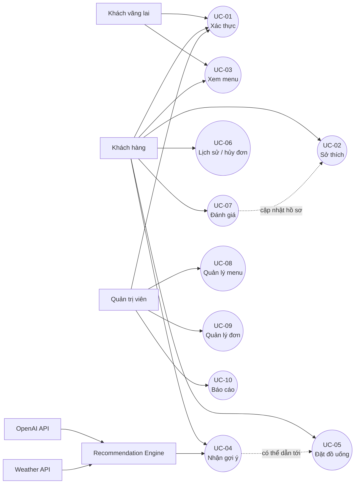
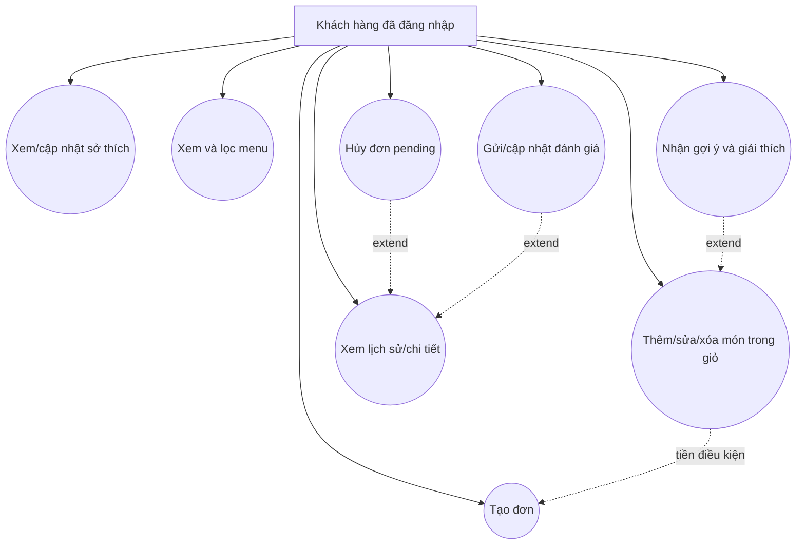
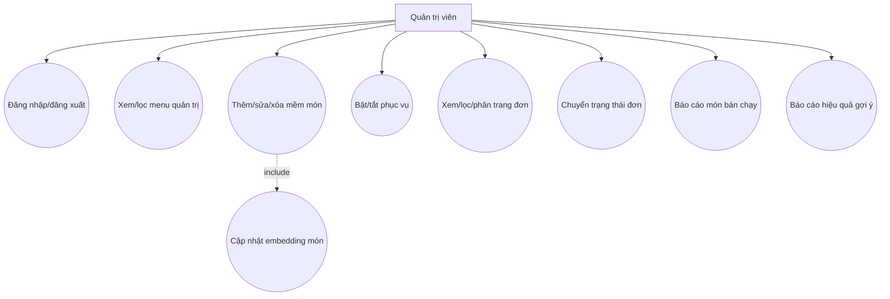

# 02. Tác nhân và ca sử dụng

## 2.1. Xác định tác nhân

| STT | Tác nhân | Loại | Vai trò trong hệ thống đề xuất |
|---:|---|---|---|
| 1 | Khách vãng lai | Chính | Đăng ký, đăng nhập và xem menu public. |
| 2 | Khách hàng (`customer`) | Chính | Quản lý sở thích, xem menu/gợi ý, quản lý giỏ, đặt/hủy/xem đơn và đánh giá. |
| 3 | Quản trị viên (`admin`) | Chính | Quản lý menu, xử lý đơn và xem báo cáo. |
| 4 | Recommendation Engine | Hệ thống phụ | Tổng hợp context, lọc ứng viên, tính cosine, phối hợp LLM và ghi log. |
| 5 | OpenAI API | Ngoài hệ thống | Sinh vector embedding, re-rank top ứng viên và tạo giải thích. |
| 6 | Weather API | Ngoài hệ thống | Cung cấp thời tiết/nhiệt độ theo tọa độ gần đúng. |
| 7 | Queue worker | Hạ tầng | Xử lý bất đồng bộ việc cập nhật embedding món và hồ sơ user. |

## 2.2. Danh sách ca sử dụng

| Mã | Tên ca sử dụng | Tác nhân chính | Mục tiêu |
|---|---|---|---|
| UC-01 | Đăng ký, đăng nhập, đăng xuất, xem phiên | Khách vãng lai/customer/admin | Xác thực và thiết lập phiên an toàn. |
| UC-02 | Khai báo và cập nhật sở thích | Customer | Tạo hồ sơ explicit và profile text. |
| UC-03 | Xem menu và lọc danh mục | Khách vãng lai/customer | Tìm món còn phục vụ. |
| UC-04 | Nhận gợi ý cá nhân hóa | Customer | Nhận top món phù hợp cùng giải thích. |
| UC-05 | Quản lý giỏ và đặt đồ uống | Customer | Tạo đơn chính xác theo tùy chọn. |
| UC-06 | Xem lịch sử/chi tiết và hủy đơn | Customer | Theo dõi đơn và hủy khi hợp lệ. |
| UC-07 | Đánh giá món đã uống | Customer | Gửi feedback cho món thuộc đơn hoàn tất. |
| UC-08 | Quản lý menu | Admin | CRUD, bật/tắt và xóa mềm món. |
| UC-09 | Quản lý đơn hàng | Admin | Lọc, xem và chuyển trạng thái đơn. |
| UC-10 | Xem báo cáo | Admin | Theo dõi bán hàng và hiệu quả recommendation. |

## 2.3. Biểu đồ use case tổng quát

## 2.4. Use case của khách hàng

## 2.5. Use case của quản trị viên

## 2.6. Quan hệ include/extend

| Ca sử dụng | Quan hệ | Ca sử dụng/hành vi liên quan | Ý nghĩa thiết kế |
|---|---|---|---|
| UC-05 Đặt đồ uống | include | Xác thực, kiểm tra giỏ, kiểm tra món khả dụng, snapshot giá | Là các bước bắt buộc trước khi commit order. |
| UC-06 Hủy đơn | extend | Xem lịch sử/chi tiết | Chỉ xuất hiện khi đơn thuộc user và đang `pending`. |
| UC-07 Đánh giá | extend | Xem đơn hoàn tất | Chỉ xuất hiện cho item thuộc order `done`. |
| UC-08 Quản lý menu | include | Kiểm tra role admin | Mọi thao tác ghi menu phải qua authorization. |
| UC-08 Thêm/sửa món | include | Dispatch embedding job | Thay đổi nguồn mô tả phải tạo lại vector bất đồng bộ. |
| UC-04 Gợi ý | include | Lấy context, pre-filter, cosine, re-rank, log | Tạo chuỗi recommendation thống nhất. |
| UC-04 Gợi ý | extend | Rule-based fallback | Kích hoạt khi thiếu location/weather/vector hoặc dịch vụ AI lỗi. |
| UC-10 Hiệu quả gợi ý | include | Đọc log và đối chiếu order item | Đo lượt recommendation dẫn đến mua trong cửa sổ thời gian. |

## 2.7. Ma trận tác nhân–quyền

| Chức năng | Khách vãng lai | Customer | Admin | Dịch vụ ngoài |
|---|:---:|:---:|:---:|:---:|
| Đăng ký/đăng nhập | ✓ | ✓ | ✓ | — |
| Xem menu public | ✓ | ✓ | ✓ | — |
| Sở thích/gợi ý/giỏ/đặt/rating | — | ✓ | — | OpenAI/Weather hỗ trợ UC-04 |
| Xem/hủy đơn cá nhân | — | ✓ | — | — |
| Quản lý menu | — | — | ✓ | OpenAI tạo embedding |
| Quản lý mọi đơn | — | — | ✓ | — |
| Báo cáo | — | — | ✓ | — |
