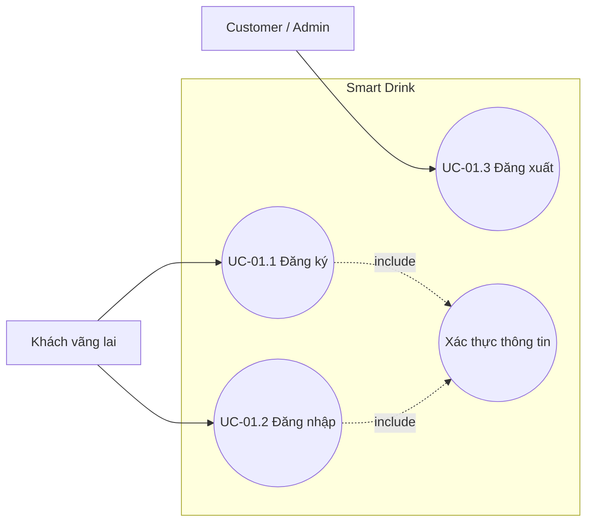
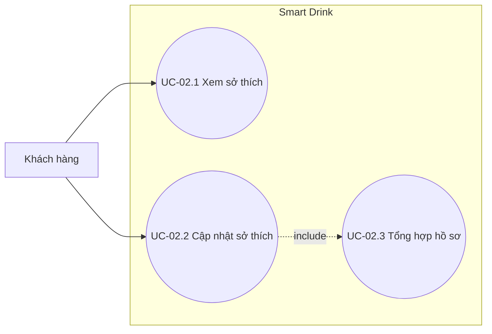
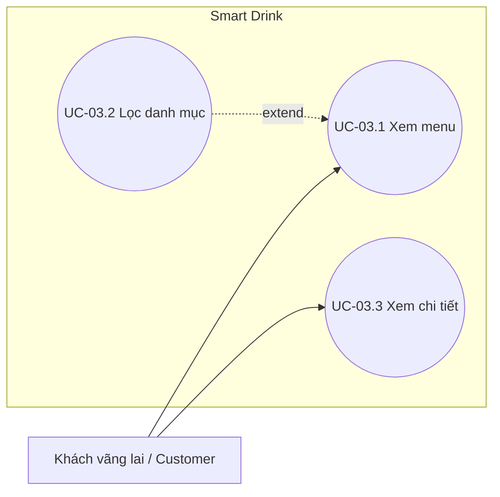
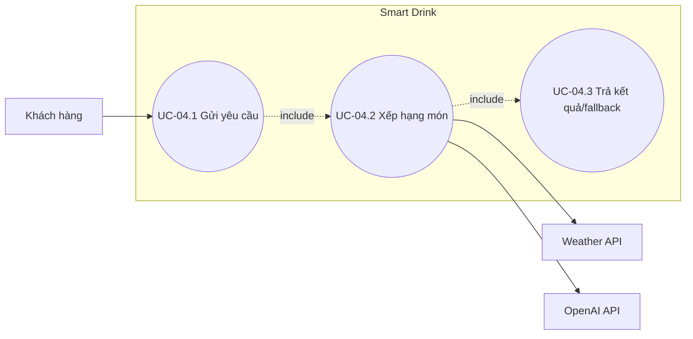
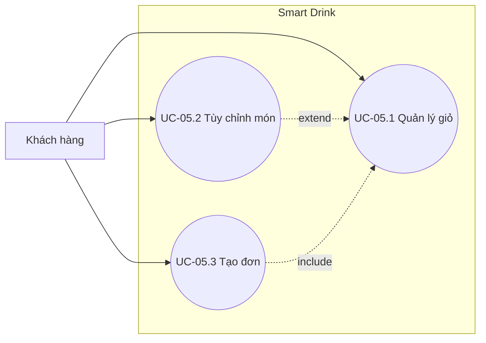
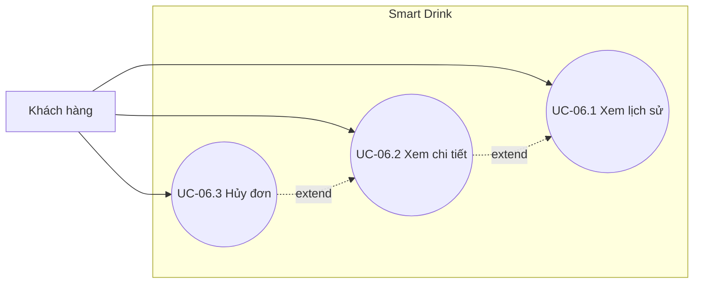
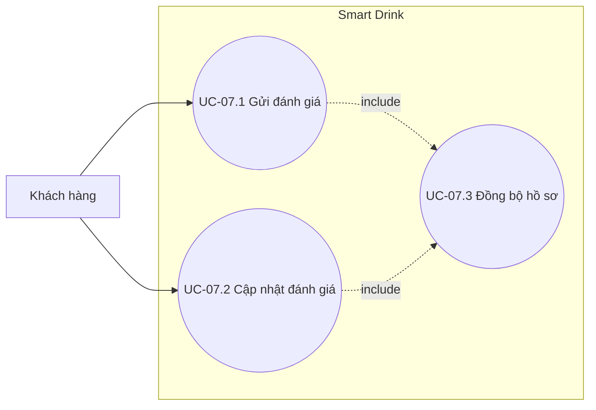
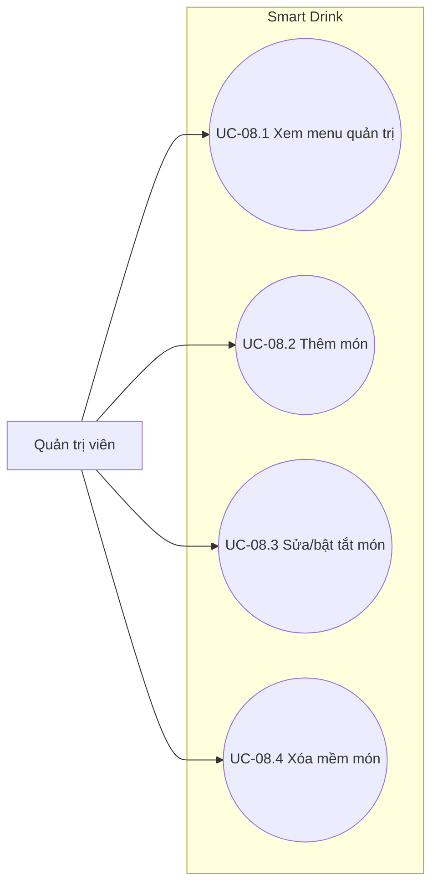
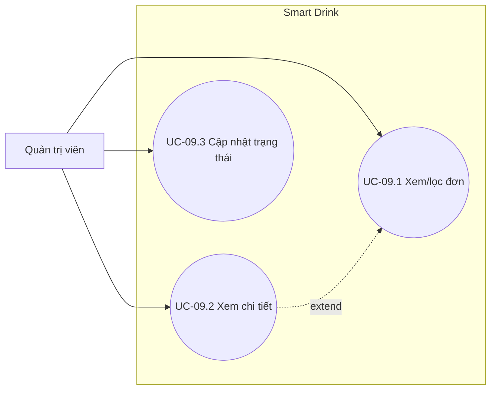
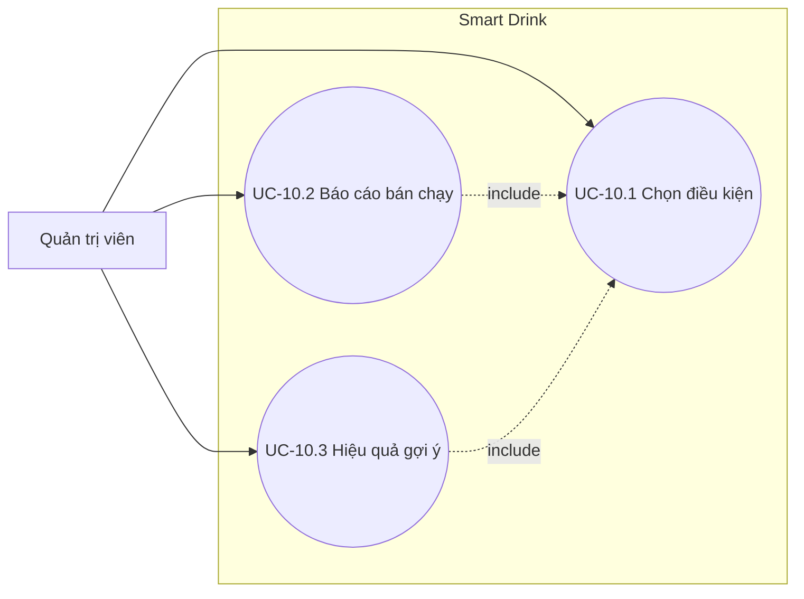

# 03. ĐẶC TẢ VÀ BIỂU ĐỒ CA SỬ DỤNG CHI TIẾT

Mỗi UC tổng quát được phân rã thành các UC con có mục tiêu độc lập. Mỗi nhóm giữ một biểu đồ use case để thể hiện quan hệ giữa tác nhân và các UC con; sau biểu đồ là các bảng đặc tả riêng theo cấu trúc của `chuong_3.md`.

## 3.1. UC-01 — Xác thực và quản lý phiên

### 3.1.1. Biểu đồ UC-01

### 3.1.2. UC-01.1 — Đăng ký tài khoản

| Thuộc tính | Nội dung |
|---|---|
| Tên use case | Đăng ký tài khoản |
| Tác nhân | Khách vãng lai |
| Mục đích | Tạo tài khoản customer mới. |
| Điều kiện tiên quyết | Email chưa tồn tại; người dùng chưa đăng nhập. |
| Mô tả chung | Người dùng cung cấp tên, email, mật khẩu và xác nhận mật khẩu. |
| Luồng sự kiện | 1. Mở form đăng ký. 2. Nhập thông tin. 3. Hệ thống kiểm tra dữ liệu. 4. Tạo user role `customer` và token. 5. Chuyển đến trang chính. |
| Ngoại lệ | Email trùng, sai định dạng hoặc mật khẩu không đạt yêu cầu: báo lỗi và không tạo tài khoản. |
| Hậu điều kiện | User và token hợp lệ được tạo; không trả password trong response. |

### 3.1.3. UC-01.2 — Đăng nhập

| Thuộc tính | Nội dung |
|---|---|
| Tên use case | Đăng nhập |
| Tác nhân | Customer, Admin |
| Mục đích | Thiết lập phiên truy cập đúng vai trò. |
| Điều kiện tiên quyết | Tài khoản tồn tại; người dùng chưa có phiên hợp lệ. |
| Mô tả chung | Người dùng nhập email và mật khẩu để nhận Bearer token. |
| Luồng sự kiện | 1. Mở form. 2. Nhập thông tin. 3. Hệ thống xác minh mật khẩu. 4. Cấp token và trả user. 5. Điều hướng theo role. |
| Ngoại lệ | Sai credentials: thông báo chung, không tiết lộ email có tồn tại hay không. |
| Hậu điều kiện | Token và user được lưu ở client; request sau có header xác thực. |

### 3.1.4. UC-01.3 — Đăng xuất

| Thuộc tính | Nội dung |
|---|---|
| Tên use case | Đăng xuất |
| Tác nhân | Customer, Admin |
| Mục đích | Kết thúc phiên hiện tại. |
| Điều kiện tiên quyết | Người dùng đã đăng nhập. |
| Mô tả chung | Người dùng yêu cầu đăng xuất, hệ thống thu hồi token và xóa phiên phía client. |
| Luồng sự kiện | 1. Chọn đăng xuất. 2. Client gửi token. 3. Backend thu hồi token. 4. Client xóa dữ liệu phiên. 5. Trở về đăng nhập. |
| Ngoại lệ | Token hết hạn: client vẫn xóa phiên cục bộ và chuyển về đăng nhập. |
| Hậu điều kiện | Token cũ không còn được dùng để gọi route bảo vệ. |

## 3.2. UC-02 — Quản lý sở thích

### 3.2.1. Biểu đồ UC-02

### 3.2.2. UC-02.1 — Xem sở thích

| Thuộc tính | Nội dung |
|---|---|
| Tác nhân | Customer |
| Mục đích | Xem tag khẩu vị, đường/đá mặc định và dị ứng. |
| Điều kiện tiên quyết | Đã đăng nhập. |
| Mô tả chung | Hệ thống tải preference của customer hoặc bộ giá trị mặc định. |
| Luồng sự kiện | 1. Mở trang sở thích. 2. Backend xác định user. 3. Đọc preference. 4. Trả dữ liệu cho form. |
| Ngoại lệ | Chưa có bản ghi: trả giá trị mặc định, không tạo dòng DB. |
| Hậu điều kiện | Không thay đổi dữ liệu. |

### 3.2.3. UC-02.2 — Cập nhật sở thích

| Thuộc tính | Nội dung |
|---|---|
| Tác nhân | Customer |
| Mục đích | Lưu sở thích dùng cho đặt hàng và gợi ý. |
| Điều kiện tiên quyết | Đã đăng nhập. |
| Mô tả chung | Customer chọn tag, đường/đá và nhập dị ứng rồi lưu. |
| Luồng sự kiện | 1. Sửa form. 2. Gửi dữ liệu. 3. Kiểm tra enum/độ dài. 4. `updateOrCreate` preference. 5. Thông báo thành công. |
| Ngoại lệ | Dữ liệu sai: trả 422 và giữ nội dung form. |
| Hậu điều kiện | Mỗi user vẫn chỉ có một preference. |

### 3.2.4. UC-02.3 — Tổng hợp hồ sơ cá nhân hóa

| Thuộc tính | Nội dung |
|---|---|
| Tác nhân | Customer; queue worker phụ |
| Mục đích | Tạo `profile_text` và làm mới embedding khi cần. |
| Điều kiện tiên quyết | Preference vừa thay đổi hoặc feedback mới được ghi nhận. |
| Mô tả chung | Hệ thống kết hợp sở thích, món mua gần đây và rating cao. |
| Luồng sự kiện | 1. Đọc dữ liệu nguồn. 2. Tạo profile text. 3. So sánh nội dung cũ. 4. Lưu text. 5. Nếu đổi, xếp job embedding. |
| Ngoại lệ | Dịch vụ embedding lỗi: retry theo backoff, không làm mất profile text. |
| Hậu điều kiện | Hồ sơ văn bản được đồng bộ; vector nhất quán theo cơ chế bất đồng bộ. |

## 3.3. UC-03 — Xem menu đồ uống

### 3.3.1. Biểu đồ UC-03

### 3.3.2. UC-03.1 — Xem danh sách menu

| Thuộc tính | Nội dung |
|---|---|
| Tác nhân | Khách vãng lai, Customer |
| Mục đích | Xem các món đang phục vụ. |
| Điều kiện tiên quyết | Không yêu cầu đăng nhập. |
| Mô tả chung | Hệ thống trả món available, chưa soft-delete, sắp theo tên. |
| Luồng sự kiện | 1. Mở menu. 2. Gửi yêu cầu. 3. Lọc món khả dụng. 4. Hiển thị thẻ món. |
| Ngoại lệ | Không có món: hiển thị trạng thái rỗng; lỗi API: cho phép thử lại. |
| Hậu điều kiện | Không thay đổi dữ liệu. |

### 3.3.3. UC-03.2 — Lọc theo danh mục

| Thuộc tính | Nội dung |
|---|---|
| Tác nhân | Khách vãng lai, Customer |
| Mục đích | Thu hẹp menu theo category. |
| Điều kiện tiên quyết | Danh sách menu đã mở. |
| Mô tả chung | Người dùng chọn category hoặc chọn tất cả. |
| Luồng sự kiện | 1. Chọn danh mục. 2. Hệ thống áp dụng bộ lọc. 3. Cập nhật danh sách. |
| Ngoại lệ | Category không có món: hiển thị danh sách rỗng. |
| Hậu điều kiện | Trạng thái lọc được giữ trong phiên màn hình. |

### 3.3.4. UC-03.3 — Xem chi tiết món

| Thuộc tính | Nội dung |
|---|---|
| Tác nhân | Khách vãng lai, Customer |
| Mục đích | Xem tên, mô tả, thành phần, giá, nhiệt độ và tag. |
| Điều kiện tiên quyết | Món tồn tại và đang available. |
| Mô tả chung | Người dùng chọn một món từ menu. |
| Luồng sự kiện | 1. Chọn món. 2. Hệ thống tải chi tiết. 3. Hiển thị thông tin và hành động thêm giỏ. |
| Ngoại lệ | Món vừa ngừng bán hoặc bị xóa: trả 404 và quay lại menu. |
| Hậu điều kiện | Không lộ trường embedding trong response. |

## 3.4. UC-04 — Nhận gợi ý cá nhân hóa

### 3.4.1. Biểu đồ UC-04

### 3.4.2. UC-04.1 — Gửi yêu cầu gợi ý

| Thuộc tính | Nội dung |
|---|---|
| Tác nhân | Customer |
| Mục đích | Yêu cầu món phù hợp với hồ sơ và ngữ cảnh. |
| Điều kiện tiên quyết | Đã đăng nhập; có món available. |
| Mô tả chung | Customer có thể gửi occasion và vị trí gần đúng. |
| Luồng sự kiện | 1. Mở khu vực gợi ý. 2. Chọn dịp/cấp vị trí tùy ý. 3. Gửi request. 4. Hiển thị loading. |
| Ngoại lệ | Lat/lon sai: 422; từ chối vị trí: tiếp tục không có weather. |
| Hậu điều kiện | Request hợp lệ được chuyển sang xếp hạng. |

### 3.4.3. UC-04.2 — Xếp hạng món

| Thuộc tính | Nội dung |
|---|---|
| Tác nhân | Recommendation Engine; Weather/OpenAI phụ |
| Mục đích | Chọn top món phù hợp. |
| Điều kiện tiên quyết | Có request hợp lệ. |
| Mô tả chung | Tạo context, lọc món, tính cosine top 10 và LLM re-rank top 5. |
| Luồng sự kiện | 1. Lấy giờ/weather. 2. Lọc món available. 3. Tính similarity. 4. Lấy top 10. 5. Re-rank top 5 và sinh giải thích. |
| Ngoại lệ | Thiếu vector hoặc API lỗi: chuyển sang rule-based/popular fallback. |
| Hậu điều kiện | Có danh sách kết quả theo schema thống nhất. |

### 3.4.4. UC-04.3 — Trả kết quả và ghi log

| Thuộc tính | Nội dung |
|---|---|
| Tác nhân | Customer |
| Mục đích | Hiển thị kết quả, điểm, giải thích và nguồn fallback. |
| Điều kiện tiên quyết | Quá trình xếp hạng đã kết thúc. |
| Mô tả chung | Hệ thống ghi context/candidate/rank rồi trả danh sách cho giao diện. |
| Luồng sự kiện | 1. Ghi recommendation log. 2. Trả món, score, explanation. 3. Customer xem hoặc thêm món vào giỏ. |
| Ngoại lệ | Không có ứng viên: trả mảng rỗng đúng schema; lỗi log không làm hỏng response. |
| Hậu điều kiện | Log append-only được dùng để tính conversion. |

## 3.5. UC-05 — Quản lý giỏ và đặt hàng

### 3.5.1. Biểu đồ UC-05

### 3.5.2. UC-05.1 — Thêm và cập nhật giỏ hàng

| Thuộc tính | Nội dung |
|---|---|
| Tác nhân | Customer |
| Mục đích | Thêm, tăng/giảm số lượng hoặc xóa món. |
| Điều kiện tiên quyết | Món đang available. |
| Mô tả chung | Giỏ được lưu trong Pinia và tính lại tổng tạm tính. |
| Luồng sự kiện | 1. Chọn thêm món. 2. Tạo/gộp item. 3. Điều chỉnh số lượng 1–20. 4. Tính tổng. |
| Ngoại lệ | Số lượng ngoài giới hạn: không cập nhật và báo lỗi. |
| Hậu điều kiện | Giỏ phản ánh đúng món và số lượng. |

### 3.5.3. UC-05.2 — Tùy chỉnh món

| Thuộc tính | Nội dung |
|---|---|
| Tác nhân | Customer |
| Mục đích | Chọn đường, đá và ghi chú cho từng item. |
| Điều kiện tiên quyết | Item tồn tại trong giỏ. |
| Mô tả chung | Mặc định lấy từ preference và cho phép thay đổi riêng. |
| Luồng sự kiện | 1. Mở item. 2. Chọn enum đường/đá. 3. Nhập note. 4. Lưu vào giỏ. |
| Ngoại lệ | Enum sai hoặc note quá dài: hiển thị lỗi. |
| Hậu điều kiện | Tùy chọn gắn đúng item, không áp dụng nhầm món khác. |

### 3.5.4. UC-05.3 — Tạo đơn hàng

| Thuộc tính | Nội dung |
|---|---|
| Tác nhân | Customer |
| Mục đích | Tạo order `pending` từ giỏ. |
| Điều kiện tiên quyết | Đã đăng nhập; giỏ không rỗng. |
| Mô tả chung | Customer chọn `dine_in`/`takeaway`, occasion và xác nhận. |
| Luồng sự kiện | 1. Gửi items/context. 2. Backend validation. 3. Mở transaction. 4. Kiểm tra món/đọc giá DB. 5. Tạo order và snapshot items. 6. Commit, trả mã đơn và xóa giỏ. |
| Ngoại lệ | Món hết hoặc dữ liệu sai: giữ giỏ; lỗi DB: rollback toàn bộ. |
| Hậu điều kiện | `total_price = Σ subtotal`; không tin giá từ client. |

## 3.6. UC-06 — Theo dõi và hủy đơn

### 3.6.1. Biểu đồ UC-06

### 3.6.2. UC-06.1 — Xem lịch sử đơn

| Thuộc tính | Nội dung |
|---|---|
| Tác nhân | Customer |
| Mục đích | Xem các đơn của chính mình theo trang. |
| Điều kiện tiên quyết | Đã đăng nhập. |
| Mô tả chung | Danh sách sắp mới nhất trước, kèm trạng thái và tổng tiền. |
| Luồng sự kiện | 1. Mở lịch sử. 2. Tải trang đầu. 3. Hiển thị đơn. 4. Chuyển trang khi cần. |
| Ngoại lệ | Chưa có đơn: hiển thị empty state. |
| Hậu điều kiện | Không thay đổi dữ liệu. |

### 3.6.3. UC-06.2 — Xem chi tiết đơn

| Thuộc tính | Nội dung |
|---|---|
| Tác nhân | Customer |
| Mục đích | Xem items, tùy chọn, giá, context và trạng thái. |
| Điều kiện tiên quyết | Order tồn tại và thuộc customer. |
| Mô tả chung | Customer chọn một đơn trong lịch sử. |
| Luồng sự kiện | 1. Chọn đơn. 2. Backend kiểm tra owner. 3. Tải items/drinks. 4. Hiển thị snapshot. |
| Ngoại lệ | Không phải owner: 403; không tồn tại: 404. |
| Hậu điều kiện | Không thay đổi order. |

### 3.6.4. UC-06.3 — Hủy đơn

| Thuộc tính | Nội dung |
|---|---|
| Tác nhân | Customer |
| Mục đích | Hủy đơn còn chờ xác nhận. |
| Điều kiện tiên quyết | Order thuộc user và có status `pending`. |
| Mô tả chung | Customer chọn hủy và xác nhận hành động. |
| Luồng sự kiện | 1. Chọn hủy. 2. Xác nhận. 3. Backend kiểm tra owner/status. 4. Chuyển `cancelled`. |
| Ngoại lệ | Order đã confirmed/done/cancelled: trả 422. |
| Hậu điều kiện | Status là `cancelled`; items/snapshot không đổi. |

## 3.7. UC-07 — Đánh giá món

### 3.7.1. Biểu đồ UC-07

### 3.7.2. UC-07.1 — Gửi đánh giá

| Thuộc tính | Nội dung |
|---|---|
| Tác nhân | Customer |
| Mục đích | Chấm 1–5 sao và nhận xét món đã uống. |
| Điều kiện tiên quyết | Order thuộc user, đã `done` và chứa món. |
| Mô tả chung | Customer mở form rating từ chi tiết đơn hoàn tất. |
| Luồng sự kiện | 1. Chọn món. 2. Chọn sao/comment. 3. Kiểm tra quyền và dữ liệu. 4. Tạo rating. |
| Ngoại lệ | Sai owner, order chưa done, món không thuộc order hoặc rating sai: từ chối. |
| Hậu điều kiện | Có một rating theo user-order-drink. |

### 3.7.3. UC-07.2 — Cập nhật đánh giá

| Thuộc tính | Nội dung |
|---|---|
| Tác nhân | Customer |
| Mục đích | Sửa số sao hoặc nhận xét đã gửi. |
| Điều kiện tiên quyết | Rating hợp lệ đã tồn tại. |
| Mô tả chung | Gửi lại cùng user-order-drink sẽ cập nhật dòng cũ. |
| Luồng sự kiện | 1. Mở rating cũ. 2. Chỉnh nội dung. 3. Validation. 4. Upsert rating. |
| Ngoại lệ | Comment quá 2000 ký tự: 422. |
| Hậu điều kiện | Không tạo rating trùng khóa nghiệp vụ. |

### 3.7.4. UC-07.3 — Đồng bộ hồ sơ sau đánh giá

| Thuộc tính | Nội dung |
|---|---|
| Tác nhân | Hệ thống; queue worker phụ |
| Mục đích | Dùng rating cao làm phản hồi cho recommendation. |
| Điều kiện tiên quyết | Rating vừa được tạo/cập nhật. |
| Mô tả chung | Hệ thống tổng hợp lại profile và dispatch job khi text đổi. |
| Luồng sự kiện | 1. Đọc rating cao gần đây. 2. Tạo profile text. 3. So sánh. 4. Lưu và dispatch job. |
| Ngoại lệ | Embedding lỗi: rating vẫn được lưu; job retry. |
| Hậu điều kiện | Profile phản ánh feedback mới. |

## 3.8. UC-08 — Quản lý menu

### 3.8.1. Biểu đồ UC-08

### 3.8.2. UC-08.1 — Xem menu quản trị

| Thuộc tính | Nội dung |
|---|---|
| Tác nhân | Admin |
| Mục đích | Xem tất cả món chưa xóa, gồm món ngừng bán. |
| Điều kiện tiên quyết | Đã đăng nhập role admin. |
| Mô tả chung | Admin mở danh sách quản lý menu. |
| Luồng sự kiện | 1. Kiểm tra role. 2. Tải món. 3. Hiển thị giá/category/trạng thái. |
| Ngoại lệ | Customer: 403; guest: 401. |
| Hậu điều kiện | Không thay đổi dữ liệu. |

### 3.8.3. UC-08.2 — Thêm món

| Thuộc tính | Nội dung |
|---|---|
| Tác nhân | Admin |
| Mục đích | Thêm đồ uống mới vào menu. |
| Điều kiện tiên quyết | Đã xác thực admin. |
| Mô tả chung | Admin nhập tên, mô tả, thành phần, category, giá, nhiệt độ và tag. |
| Luồng sự kiện | 1. Mở form. 2. Nhập dữ liệu. 3. Validation. 4. Tạo drink. 5. Dispatch embedding job. |
| Ngoại lệ | Giá âm, enum/URL sai hoặc thiếu tên: 422. |
| Hậu điều kiện | Drink mới tồn tại và chờ tạo embedding. |

### 3.8.4. UC-08.3 — Sửa và bật/tắt món

| Thuộc tính | Nội dung |
|---|---|
| Tác nhân | Admin |
| Mục đích | Cập nhật thông tin hoặc trạng thái phục vụ. |
| Điều kiện tiên quyết | Drink tồn tại, chưa soft-delete. |
| Mô tả chung | Admin sửa field hoặc `is_available`. |
| Luồng sự kiện | 1. Chọn món. 2. Sửa dữ liệu. 3. Validation. 4. Lưu. 5. Nếu nguồn mô tả đổi, làm mới embedding. |
| Ngoại lệ | Không tìm thấy món: 404; dữ liệu sai: 422. |
| Hậu điều kiện | Menu public/order/recommendation dùng trạng thái mới. |

### 3.8.5. UC-08.4 — Xóa mềm món

| Thuộc tính | Nội dung |
|---|---|
| Tác nhân | Admin |
| Mục đích | Loại món khỏi menu mới nhưng giữ lịch sử. |
| Điều kiện tiên quyết | Drink tồn tại. |
| Mô tả chung | Admin xác nhận xóa; backend đặt `deleted_at`. |
| Luồng sự kiện | 1. Chọn xóa. 2. Xác nhận. 3. Kiểm tra role. 4. Soft-delete món. |
| Ngoại lệ | Món không tồn tại: 404. |
| Hậu điều kiện | Món không còn xuất hiện/được đặt; order cũ vẫn tham chiếu. |

## 3.9. UC-09 — Quản lý đơn hàng

### 3.9.1. Biểu đồ UC-09

### 3.9.2. UC-09.1 — Xem và lọc đơn

| Thuộc tính | Nội dung |
|---|---|
| Tác nhân | Admin |
| Mục đích | Theo dõi tất cả đơn theo trang, status hoặc user. |
| Điều kiện tiên quyết | Đã xác thực admin. |
| Mô tả chung | Hệ thống trả 15 đơn/trang, mới nhất trước. |
| Luồng sự kiện | 1. Mở danh sách. 2. Chọn bộ lọc. 3. Validation query. 4. Tải và hiển thị đơn. |
| Ngoại lệ | Status/user sai: 422; không có dữ liệu: danh sách rỗng. |
| Hậu điều kiện | Không thay đổi order. |

### 3.9.3. UC-09.2 — Xem chi tiết đơn quản trị

| Thuộc tính | Nội dung |
|---|---|
| Tác nhân | Admin |
| Mục đích | Xem customer, items, tùy chọn, context và tổng. |
| Điều kiện tiên quyết | Order tồn tại. |
| Mô tả chung | Admin chọn một order từ danh sách. |
| Luồng sự kiện | 1. Chọn đơn. 2. Kiểm tra role. 3. Tải customer/items/drinks. 4. Hiển thị. |
| Ngoại lệ | Không tồn tại: 404. |
| Hậu điều kiện | Không thay đổi dữ liệu. |

### 3.9.4. UC-09.3 — Cập nhật trạng thái đơn

| Thuộc tính | Nội dung |
|---|---|
| Tác nhân | Admin |
| Mục đích | Điều khiển tiến trình phục vụ. |
| Điều kiện tiên quyết | Order tồn tại và chưa ở trạng thái kết thúc. |
| Mô tả chung | Admin chọn trạng thái tiếp theo theo state machine. |
| Luồng sự kiện | 1. Chọn hành động. 2. Validation enum. 3. Kiểm tra transition. 4. Cập nhật status. |
| Ngoại lệ | Bỏ bước, chuyển ngược hoặc sửa `done/cancelled`: 422. |
| Hậu điều kiện | Chỉ cho phép `pending → confirmed → done` hoặc hủy hợp lệ. |

## 3.10. UC-10 — Xem báo cáo

### 3.10.1. Biểu đồ UC-10

### 3.10.2. UC-10.1 — Chọn điều kiện báo cáo

| Thuộc tính | Nội dung |
|---|---|
| Tác nhân | Admin |
| Mục đích | Chọn from/to, limit và cửa sổ conversion. |
| Điều kiện tiên quyết | Đã xác thực admin. |
| Mô tả chung | Admin nhập bộ lọc trước khi xem báo cáo. |
| Luồng sự kiện | 1. Chọn thời gian. 2. Nhập giới hạn. 3. Hệ thống validation. 4. Áp dụng query. |
| Ngoại lệ | Ngày đảo, limit/window không dương: 422. |
| Hậu điều kiện | Điều kiện hợp lệ được dùng để tổng hợp. |

### 3.10.3. UC-10.2 — Xem báo cáo món bán chạy

| Thuộc tính | Nội dung |
|---|---|
| Tác nhân | Admin |
| Mục đích | Xem quantity, revenue và rating trung bình theo món. |
| Điều kiện tiên quyết | Bộ lọc hợp lệ. |
| Mô tả chung | Chỉ tổng hợp items thuộc order `done`. |
| Luồng sự kiện | 1. Lọc order done. 2. Nhóm theo drink. 3. Tính quantity/revenue/rating. 4. Sắp giảm dần. |
| Ngoại lệ | Không có dữ liệu: trả mảng rỗng và tổng bằng 0. |
| Hậu điều kiện | Không thay đổi dữ liệu nghiệp vụ. |

### 3.10.4. UC-10.3 — Xem hiệu quả gợi ý

| Thuộc tính | Nội dung |
|---|---|
| Tác nhân | Admin |
| Mục đích | Đo recommendation có dẫn đến đặt món hay không. |
| Điều kiện tiên quyết | Có recommendation log và bộ lọc hợp lệ. |
| Mô tả chung | Đối chiếu món được gợi ý với order cùng user trong cửa sổ thời gian. |
| Luồng sự kiện | 1. Đọc log. 2. Đọc order không cancelled. 3. Đối chiếu ranked IDs. 4. Tính conversion rate/vị trí. |
| Ngoại lệ | Không có log: trả tỷ lệ 0 và danh sách rỗng. |
| Hậu điều kiện | Kết quả dùng để đánh giá và cải thiện recommendation. |

## 3.11. Tổng hợp phân rã UC

| Nhóm | Các UC con |
|---|---|
| UC-01 | UC-01.1 đăng ký; UC-01.2 đăng nhập; UC-01.3 đăng xuất. |
| UC-02 | UC-02.1 xem sở thích; UC-02.2 cập nhật; UC-02.3 tổng hợp hồ sơ. |
| UC-03 | UC-03.1 xem menu; UC-03.2 lọc; UC-03.3 chi tiết. |
| UC-04 | UC-04.1 yêu cầu; UC-04.2 xếp hạng; UC-04.3 kết quả/log. |
| UC-05 | UC-05.1 giỏ; UC-05.2 tùy chỉnh; UC-05.3 tạo đơn. |
| UC-06 | UC-06.1 lịch sử; UC-06.2 chi tiết; UC-06.3 hủy. |
| UC-07 | UC-07.1 gửi rating; UC-07.2 cập nhật; UC-07.3 đồng bộ hồ sơ. |
| UC-08 | UC-08.1 danh sách; UC-08.2 thêm; UC-08.3 sửa/bật tắt; UC-08.4 xóa mềm. |
| UC-09 | UC-09.1 danh sách/lọc; UC-09.2 chi tiết; UC-09.3 trạng thái. |
| UC-10 | UC-10.1 điều kiện; UC-10.2 bán chạy; UC-10.3 hiệu quả gợi ý. |
