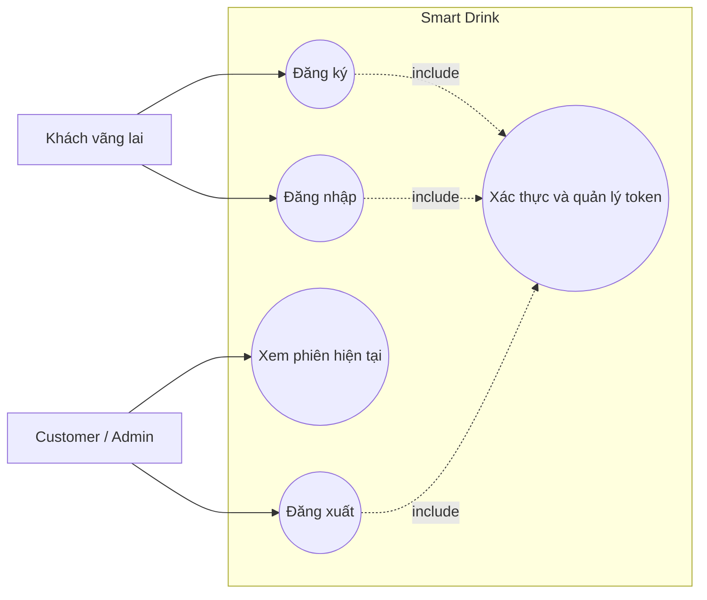
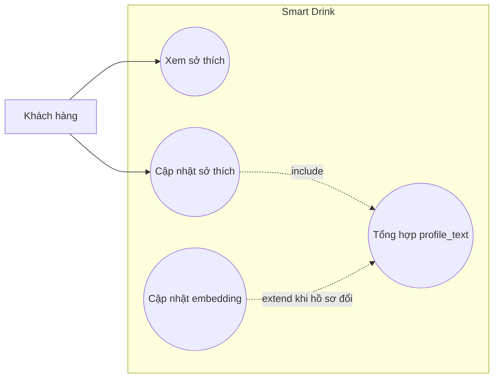
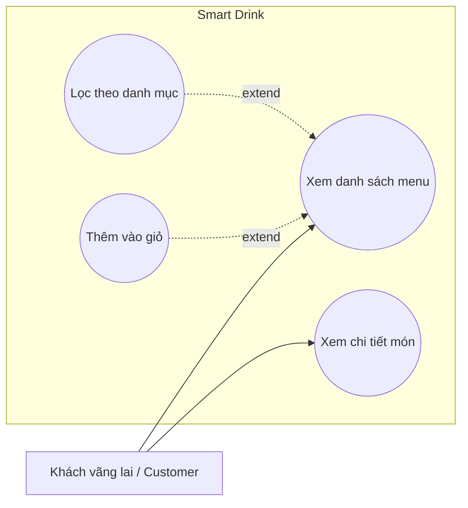
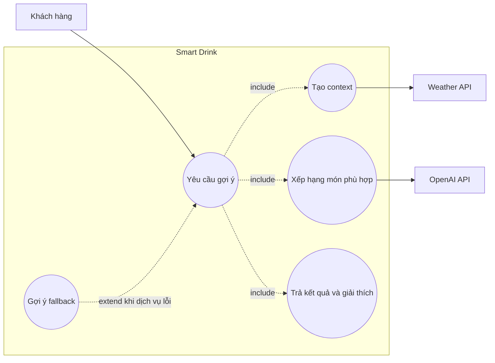
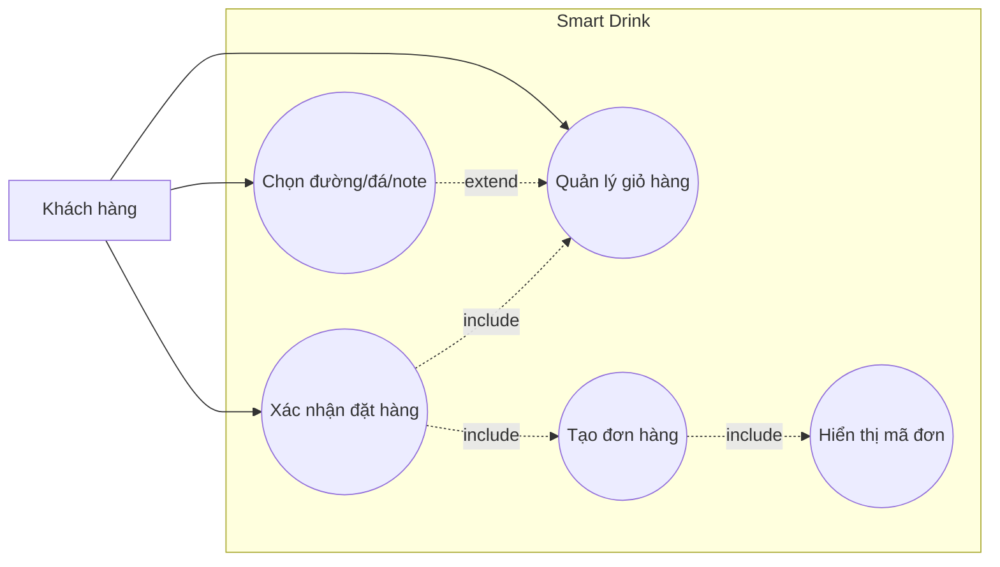
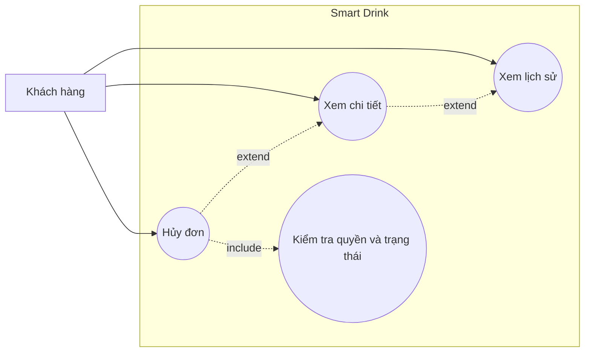
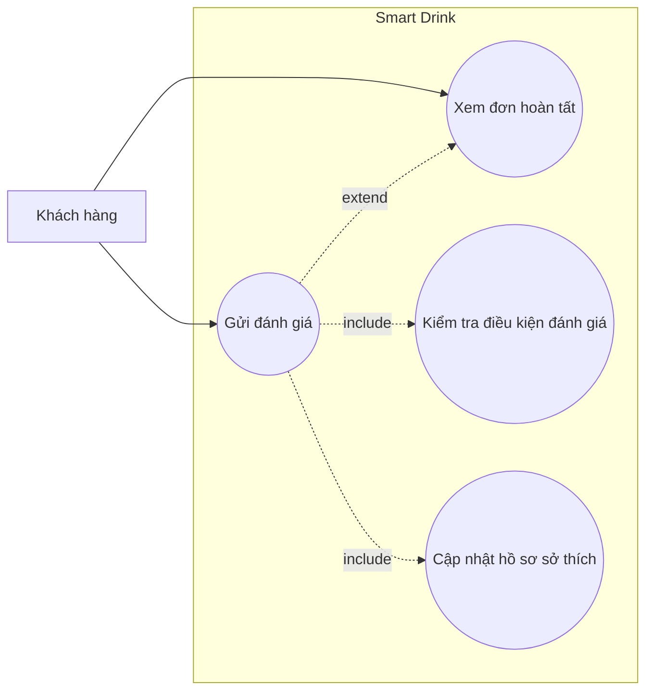
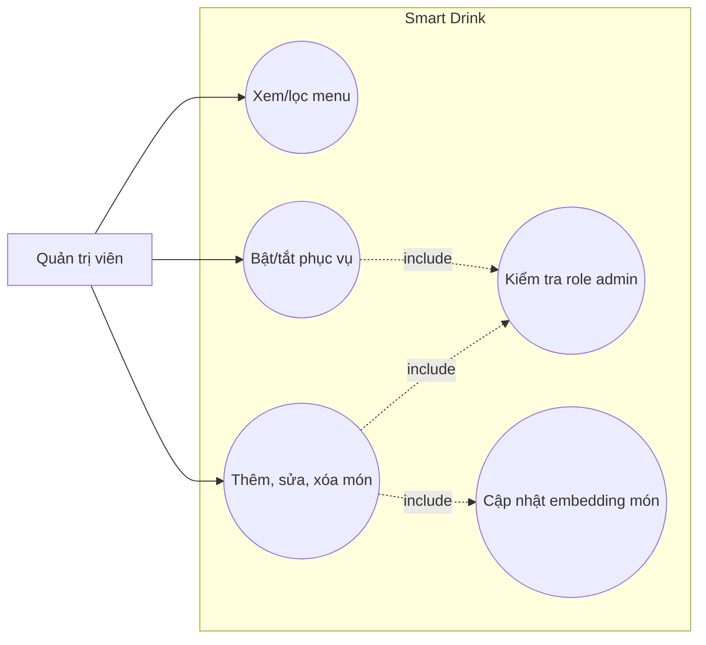
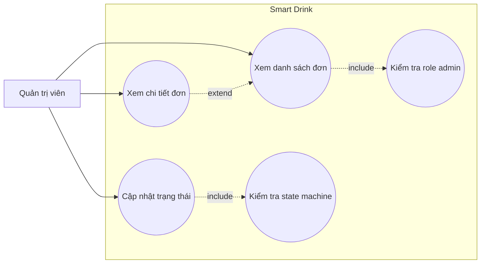
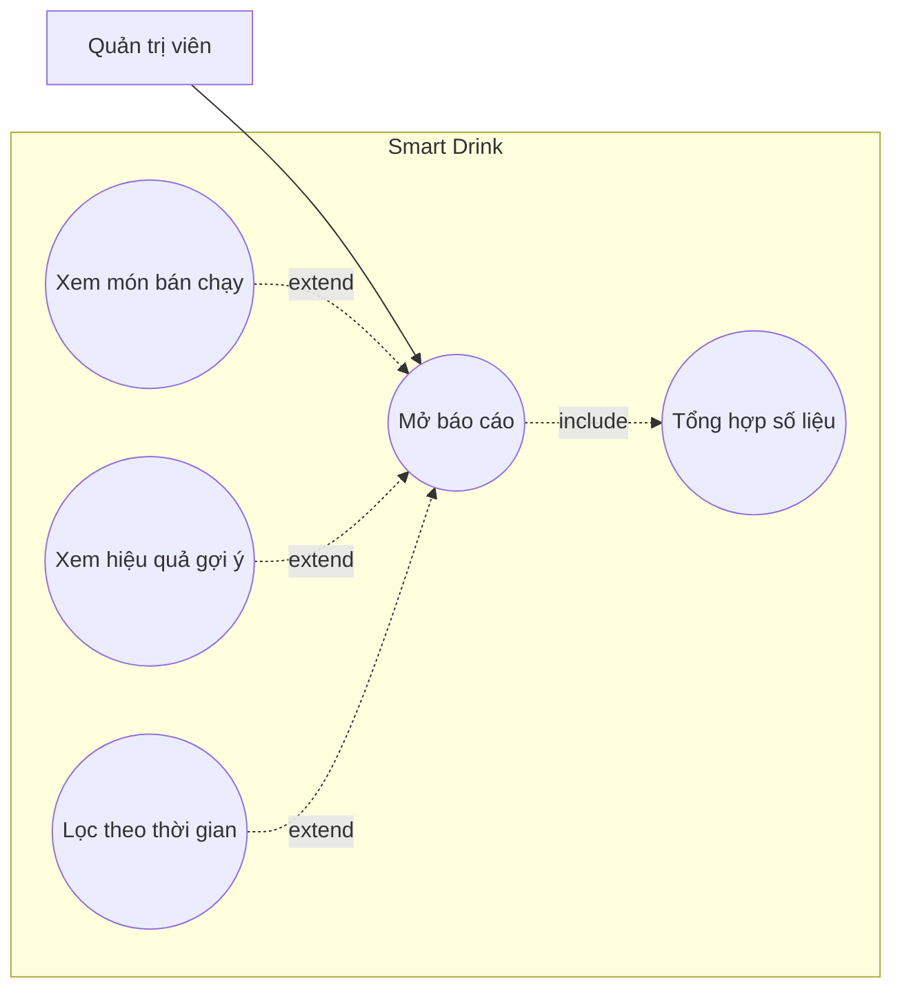

# 03. Đặc tả và biểu đồ ca sử dụng chi tiết

## 3.1. UC-01 — Đăng ký, đăng nhập và quản lý phiên

| Thuộc tính | Nội dung |
|---|---|
| Tác nhân | Khách vãng lai, customer, admin |
| Mục đích | Tạo tài khoản customer, nhận token, xem user hiện tại hoặc kết thúc phiên. |
| Tiền điều kiện | Register/login là public; xem phiên/logout cần Bearer token hợp lệ. |
| Kích hoạt | Người dùng mở form đăng ký/đăng nhập hoặc chọn đăng xuất. |
| Luồng chính | (1) Nhập thông tin. (2) Hệ thống validation. (3) Register tạo user role `customer`, hoặc login kiểm tra password hash. (4) Tạo token truy cập. (5) Client lưu phiên và chuyển đến trang phù hợp. |
| Luồng thay thế | Email trùng/sai định dạng, password yếu/không khớp hoặc credentials sai: trả lỗi, không tạo phiên. Token thiếu/hết hạn: yêu cầu đăng nhập lại. |
| Hậu điều kiện | User/token được tạo hoặc token bị thu hồi khi logout. |
| Dữ liệu | `users`, `personal_access_tokens`. |
| Tiêu chí chấp nhận | Không trả password; user đăng ký luôn là customer; route bảo vệ từ chối request không có token. |

### 3.1.1. Biểu đồ UC-01 chi tiết

## 3.2. UC-02 — Khai báo và cập nhật sở thích

| Thuộc tính | Nội dung |
|---|---|
| Tác nhân | Customer; queue worker là tác nhân phụ |
| Mục đích | Lưu khẩu vị, đường/đá mặc định, dị ứng và xây dựng hồ sơ dùng cho gợi ý. |
| Tiền điều kiện | User đã xác thực. |
| Kích hoạt | User mở trang sở thích hoặc lưu thay đổi. |
| Luồng chính | (1) Tải hồ sơ hoặc giá trị mặc định. (2) User chọn tag/đường/đá, nhập dị ứng. (3) Validation. (4) Upsert hồ sơ 1–1. (5) Tổng hợp `profile_text` từ explicit data, lịch sử mua và rating cao. (6) Nếu nguồn đổi, dispatch job tạo `profile_embedding`. |
| Luồng thay thế | Chưa có hồ sơ: trả default mà không bắt buộc tạo row. Input sai enum/độ dài: trả 422. OpenAI lỗi: giữ profile text, job retry/fail an toàn. |
| Hậu điều kiện | Preference được lưu; vector được cập nhật bất đồng bộ khi cần. |
| Dữ liệu | `user_preferences`, `order_items`, `orders`, `ratings`, `drinks`. |
| Tiêu chí chấp nhận | Không tạo hai preference cho một user; không dispatch lại nếu profile text không đổi. |

### 3.2.1. Biểu đồ UC-02 chi tiết

## 3.3. UC-03 — Xem menu đồ uống

| Thuộc tính | Nội dung |
|---|---|
| Tác nhân | Khách vãng lai, customer |
| Mục đích | Xem thông tin món còn phục vụ và thu hẹp theo danh mục. |
| Tiền điều kiện | Không bắt buộc đăng nhập để đọc menu public. |
| Kích hoạt | Người dùng mở menu hoặc chọn một category. |
| Luồng chính | (1) Yêu cầu danh sách. (2) Hệ thống lọc món available và chưa xóa mềm. (3) Tùy chọn lọc category. (4) Sắp xếp theo tên. (5) Trả thông tin không gồm vector. |
| Luồng thay thế | Không có món phù hợp: trả danh sách rỗng. Món ngừng bán khi xem detail: trả 404. API lỗi: UI hiển thị trạng thái lỗi/thử lại. |
| Hậu điều kiện | Không thay đổi dữ liệu; user có thể thêm món vào giỏ. |
| Dữ liệu | `drinks`. |
| Tiêu chí chấp nhận | Món unavailable/soft-deleted không xuất hiện; category không làm lộ món ẩn. |

### 3.3.1. Biểu đồ UC-03 chi tiết

## 3.4. UC-04 — Nhận gợi ý cá nhân hóa

| Thuộc tính | Nội dung |
|---|---|
| Tác nhân | Customer, Recommendation Engine, Weather API, OpenAI API |
| Mục đích | Trả top món phù hợp, score và giải thích theo hồ sơ/ngữ cảnh. |
| Tiền điều kiện | Customer đã đăng nhập; có ít nhất một món available. Vị trí là tùy chọn. |
| Kích hoạt | User mở khu vực gợi ý, chọn occasion hoặc chủ động làm mới. |
| Luồng chính | (1) Nhận lat/lon/occasion tùy chọn. (2) Tạo context gồm giờ và weather. (3) Pre-filter món available theo context. (4) Đọc user/drink vectors. (5) Tính cosine, lấy top 10. (6) LLM re-rank top 5 và tạo explanation. (7) Ghi log có thứ tự. (8) Trả response thống nhất. |
| Luồng thay thế | Không cấp vị trí hoặc Weather lỗi: bỏ weather. Thiếu vector/OpenAI lỗi: dùng rule-based/popular/context-only. Không có ứng viên: trả mảng rỗng đúng schema. |
| Hậu điều kiện | Ghi một recommendation log nếu sinh được kết quả; user có thể thêm món vào giỏ. |
| Dữ liệu | `user_preferences`, `drinks`, `recommendation_logs`; Redis cache weather. |
| Tiêu chí chấp nhận | Không gọi LLM cho toàn menu; fallback cùng response schema; không log secret/tọa độ chi tiết không cần thiết. |

### 3.4.1. Biểu đồ UC-04 chi tiết

## 3.5. UC-05 — Quản lý giỏ hàng và đặt đồ uống

| Thuộc tính | Nội dung |
|---|---|
| Tác nhân | Customer |
| Mục đích | Chọn món/tùy chọn và tạo đơn có snapshot giá, context. |
| Tiền điều kiện | User đăng nhập; giỏ có ít nhất một món available. |
| Kích hoạt | User thêm món hoặc chọn “Tiến hành đặt hàng”. |
| Luồng chính | (1) Thêm món vào giỏ. (2) Tăng/giảm/xóa. (3) Chọn đường, đá, note từng item. (4) Chọn `dine_in`/`takeaway`, occasion. (5) Validation. (6) Transaction tạo order `pending`. (7) Đọc giá DB và tạo item snapshot. (8) Tính tổng, commit và hiển thị xác nhận. |
| Luồng thay thế | Giỏ rỗng: không checkout. Món hết bán/input sai: báo lỗi và giữ giỏ. Lỗi transaction: rollback toàn bộ. |
| Hậu điều kiện | Tạo order/items nhất quán; xóa giỏ sau thành công. |
| Dữ liệu | `drinks`, `orders`, `order_items`, `user_preferences`. |
| Tiêu chí chấp nhận | Quantity 1–20; không tin giá từ client; `total_price = Σ subtotal`; payment chỉ mô phỏng. |

### 3.5.1. Biểu đồ UC-05 chi tiết

## 3.6. UC-06 — Xem lịch sử, chi tiết và hủy đơn

| Thuộc tính | Nội dung |
|---|---|
| Tác nhân | Customer |
| Mục đích | Theo dõi các đơn của mình và hủy khi còn chờ xác nhận. |
| Tiền điều kiện | User đã đăng nhập; chỉ truy cập order thuộc chính user. |
| Kích hoạt | User mở lịch sử, chọn đơn hoặc chọn hủy. |
| Luồng chính | (1) Tải order mới nhất theo trang. (2) Hiển thị items, tổng, context và trạng thái. (3) User mở chi tiết. (4) Nếu `pending`, chọn hủy. (5) Hệ thống kiểm tra owner/status và chuyển `cancelled`. |
| Luồng thay thế | Không phải chủ đơn: 403. Hủy đơn không còn pending: 422. Không có đơn: hiển thị empty state. |
| Hậu điều kiện | Order hợp lệ chuyển `cancelled`; snapshot và items giữ nguyên. |
| Dữ liệu | `orders`, `order_items`, `drinks`. |
| Tiêu chí chấp nhận | Lịch sử có pagination; không xem/hủy order người khác; không hủy order confirmed/done/cancelled. |

### 3.6.1. Biểu đồ UC-06 chi tiết

## 3.7. UC-07 — Đánh giá món đã uống

| Thuộc tính | Nội dung |
|---|---|
| Tác nhân | Customer; queue worker phụ |
| Mục đích | Gửi 1–5 sao và nhận xét, tạo feedback cho hồ sơ sở thích. |
| Tiền điều kiện | Order thuộc user, trạng thái `done` và chứa món cần đánh giá. |
| Kích hoạt | User chọn đánh giá ở lịch sử đơn hoàn tất. |
| Luồng chính | (1) Chọn sao/comment. (2) Validation. (3) Kiểm tra owner, status, item. (4) Upsert rating theo user-order-drink. (5) Tổng hợp lại profile text. (6) Dispatch embedding job nếu nội dung đổi. |
| Luồng thay thế | Sai owner: 403. Order chưa done/món không thuộc đơn/rating ngoài 1–5: 422. Gửi lần hai: update dòng cũ. |
| Hậu điều kiện | Rating được tạo/cập nhật; hồ sơ cá nhân hóa được đồng bộ. |
| Dữ liệu | `ratings`, `orders`, `order_items`, `user_preferences`. |
| Tiêu chí chấp nhận | Không có rating trùng cùng user-order-drink; comment tối đa 2000 ký tự. |

### 3.7.1. Biểu đồ UC-07 chi tiết

## 3.8. UC-08 — Quản lý menu

| Thuộc tính | Nội dung |
|---|---|
| Tác nhân | Admin; queue worker và OpenAI API phụ |
| Mục đích | Duy trì nội dung, giá, khả dụng và vòng đời món. |
| Tiền điều kiện | Admin đã xác thực và qua kiểm tra role. |
| Kích hoạt | Admin mở quản lý menu hoặc chọn thao tác CRUD. |
| Luồng chính | (1) Xem/lọc menu quản trị. (2) Thêm/sửa thông tin. (3) Validation. (4) Lưu DB. (5) Nếu nguồn mô tả đổi, dispatch job embedding. (6) Worker tạo vector và cập nhật món. |
| Luồng availability | Admin bật/tắt `is_available`; món ngừng bán bị loại khỏi menu/order/recommendation. |
| Luồng xóa | Admin xóa mềm; dữ liệu lịch sử vẫn tham chiếu được. |
| Hậu điều kiện | Menu và vector tương ứng nhất quán theo cơ chế eventual consistency. |
| Dữ liệu | `drinks`. |
| Tiêu chí chấp nhận | Price không âm; temperature đúng enum; image URL được kiểm tra; sửa `name/description/ingredients/tags` phải làm mới embedding. |

### 3.8.1. Biểu đồ UC-08 chi tiết

## 3.9. UC-09 — Quản lý đơn hàng

| Thuộc tính | Nội dung |
|---|---|
| Tác nhân | Admin |
| Mục đích | Xem mọi đơn, lọc/phân trang và điều khiển trạng thái phục vụ. |
| Tiền điều kiện | Admin đã xác thực. |
| Kích hoạt | Admin mở danh sách hoặc chọn hành động trạng thái. |
| Luồng chính | (1) Tải 15 đơn/trang, tùy chọn status/user. (2) Xem customer, items, order type, occasion, tổng. (3) Chọn trạng thái tiếp theo. (4) Validation enum và state machine. (5) Lưu trạng thái. |
| Luồng thay thế | Guest: 401; customer: 403; chuyển sai chiều/bỏ qua `confirmed`: 422. Admin có thể hủy `pending`/`confirmed`. |
| Hậu điều kiện | Status và `updated_at` của order thay đổi; dữ liệu item không đổi. |
| Dữ liệu | `orders`, `order_items`, `users`, `drinks`. |
| Tiêu chí chấp nhận | `done`/`cancelled` là terminal; không cho `pending → done`; query filter được validation. |

### 3.9.1. Biểu đồ UC-09 chi tiết

## 3.10. UC-10 — Xem báo cáo thống kê

| Thuộc tính | Nội dung |
|---|---|
| Tác nhân | Admin |
| Mục đích | Theo dõi món bán chạy, doanh thu/rating và conversion từ recommendation. |
| Tiền điều kiện | Admin đã xác thực; khoảng ngày và giới hạn hợp lệ. |
| Kích hoạt | Admin mở báo cáo hoặc áp dụng bộ lọc ngày. |
| Luồng best-seller | (1) Chọn from/to/limit. (2) Chỉ lấy order `done`. (3) Tổng quantity/revenue theo drink. (4) Ghép rating trung bình trong khoảng. (5) Sắp xếp giảm dần. |
| Luồng effectiveness | (1) Chọn from/to/window. (2) Đọc logs. (3) Đối chiếu `final_ranked_ids` với order của cùng user trong cửa sổ. (4) Tính tổng, tỷ lệ và vị trí chuyển đổi. |
| Luồng thay thế | Không có dữ liệu: trả 0/mảng rỗng. Date range/limit/window sai: 422. |
| Hậu điều kiện | Không thay đổi dữ liệu; kết quả dùng cho quyết định menu/recommendation. |
| Dữ liệu | `orders`, `order_items`, `ratings`, `drinks`, `recommendation_logs`. |
| Tiêu chí chấp nhận | Best-seller chỉ tính order done; conversion là order không bị `cancelled`, chứa món được gợi ý và tạo trong cửa sổ mặc định 24 giờ; không nhân bản quantity khi join ratings. |

### 3.10.1. Biểu đồ UC-10 chi tiết

