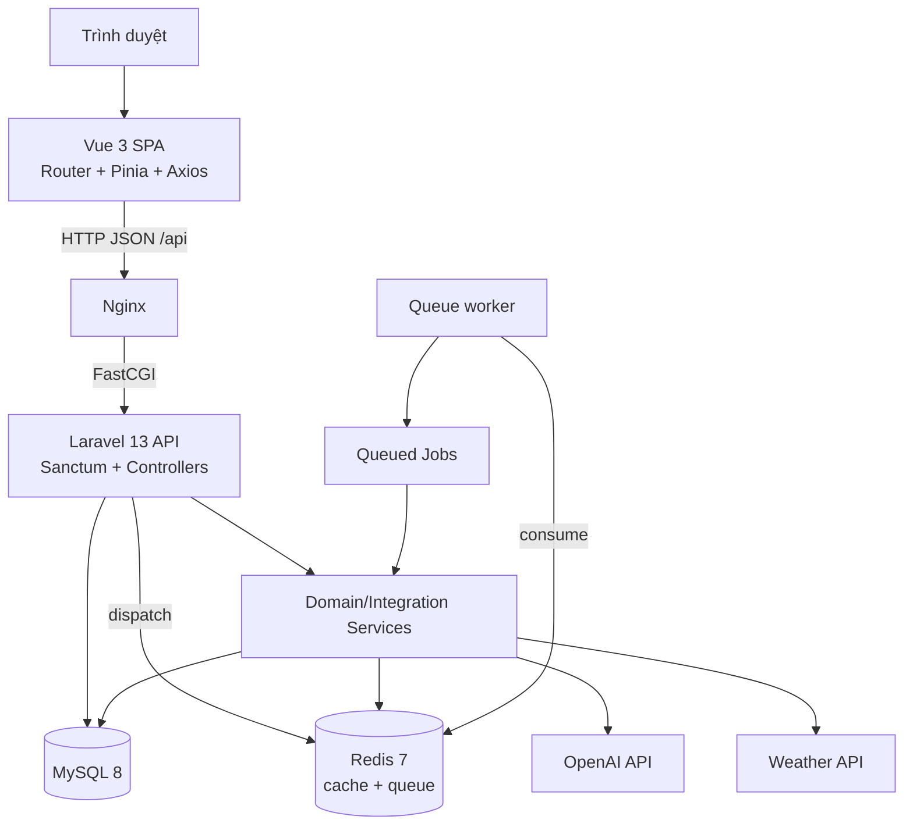
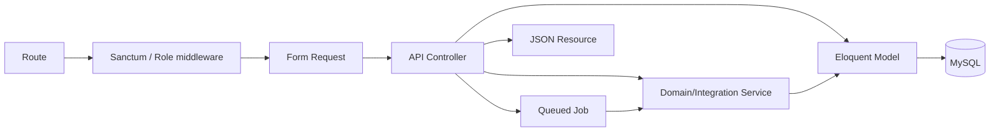
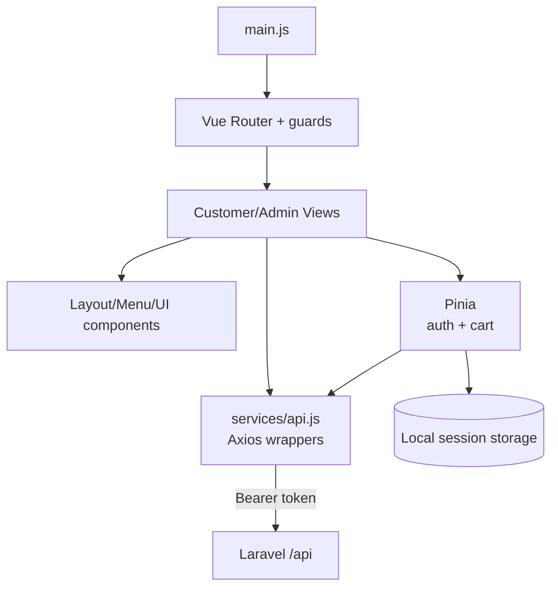
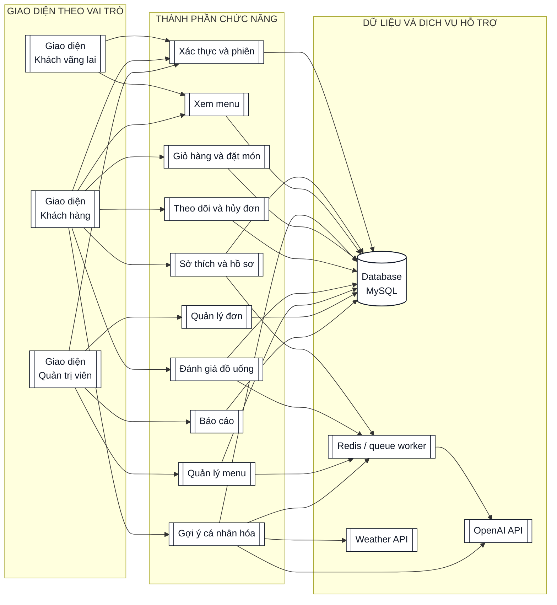

# 04. Kiến trúc và thiết kế thành phần

## 4.1. Mục tiêu kiến trúc

Kiến trúc Smart Drink cần đáp ứng bốn mục tiêu: tách giao diện khỏi nghiệp vụ, bảo vệ dữ liệu bằng API tập trung, cho phép thay đổi thuật toán recommendation độc lập và chạy đồng nhất bằng Docker Compose.

Hệ thống được thiết kế theo mô hình frontend–backend tách rời. Vue SPA giao tiếp với Laravel qua REST/JSON. Laravel thực hiện xác thực, validation, authorization và nghiệp vụ; Eloquent truy cập MySQL. Redis phục vụ cache/session/queue. OpenAI và Weather là dịch vụ ngoài, luôn được bao bằng timeout và fallback.



## 4.2. Công nghệ lựa chọn

| Lớp | Công nghệ đề xuất | Lý do |
|---|---|---|
| Backend | PHP 8.3, Laravel 13, Sanctum | REST API, validation/resource/queue và token auth đồng bộ. |
| Frontend | Vue 3, Vue Router, Pinia, Axios | SPA component-based, quản lý auth/cart và HTTP tập trung. |
| UI | Tailwind CSS 4, Lucide Vue, Inter/Poppins | Xây dựng responsive UI và design token thống nhất. |
| Dữ liệu | MySQL 8 | Phù hợp giao dịch, FK, enum, JSON và Docker. |
| Cache/queue | Redis 7 | Cache weather/recommendation và queue embedding. |
| Web/runtime | Nginx, PHP-FPM, Node 22, Docker Compose | Môi trường phát triển đồng nhất giữa thành viên. |
| Kiểm thử | PHPUnit; Vitest/Vue Test Utils; E2E | Bao phủ nghiệp vụ backend, component/store và luồng chính. |

Laravel 13 được chốt trong tài liệu thiết kế để tránh mâu thuẫn phiên bản khi bắt đầu lập trình.

## 4.3. Kiến trúc phân lớp backend



Trách nhiệm được quy định trước khi lập trình:

- **Route:** URL, HTTP method và middleware; không chứa nghiệp vụ.
- **Form Request:** validation và thông báo lỗi, kể cả query của admin/report/recommendation.
- **Controller:** điều phối request/response, gọi service và kiểm tra authorization cấp use case.
- **Service:** nghiệp vụ phức hợp, tính toán và tích hợp OpenAI/Weather.
- **Job:** công việc embedding bất đồng bộ, có retry/backoff/failed handling.
- **Model:** quan hệ, cast, scope và truy cập dữ liệu.
- **Resource:** response ổn định, không làm lộ password/vector.

## 4.4. Kiến trúc frontend



Quy tắc frontend:

- Mọi HTTP call đi qua một Axios client và wrapper theo module.
- Auth/cart dùng Pinia; enum/value chung đặt trong constants.
- Router guard cải thiện UX, nhưng backend vẫn là nguồn quyết định quyền.
- Cart khởi tạo mức đường/đá từ preference nếu có và cho phép ghi đè từng item.
- Các view phải có loading, error, empty và success state.
- Recommendation xin vị trí tùy chọn; từ chối quyền vẫn gọi API không có lat/lon.

## 4.5. Sơ đồ thành phần theo module

Sơ đồ được tổ chức cùng dạng với Component Diagram trong tài liệu mẫu: các giao diện theo vai trò nằm bên trái, nhóm chức năng nghiệp vụ nằm giữa và kho dữ liệu/dịch vụ phụ thuộc nằm bên phải. Bản chi tiết, ký hiệu và bảng giao diện giữa các thành phần được trình bày tại [09-bieu-do-thanh-phan.md](09-bieu-do-thanh-phan.md).



## 4.6. Phân chia trách nhiệm module

| Module | Backend dự kiến | Frontend dự kiến | Trách nhiệm |
|---|---|---|---|
| Auth | Auth Controller/Requests, `UserResource` | Auth store, Login/Register | Token, user và phân quyền cơ bản. |
| Preference | Preference Controller, Profile Text Service | Preference view | Explicit preference và profile text/vector. |
| Menu | Drink Controller/Resource | Home, category, drink card | Public menu và admin CRUD. |
| Cart/order | Order Controller/Requests/Resources | Cart store, Checkout | Transaction, snapshot và confirmation. |
| History | Order query/resource | Order History | Pagination, detail và cancel. |
| Rating | Rating Controller/Request | Rating form | Eligibility, upsert và feedback loop. |
| Report | Report Controller/Requests | Admin Reports | Best-seller và recommendation conversion. |
| Recommendation | Controller/Request/Resource, 3 services, 2 jobs | Recommendation component | Context, vectors, ranking, explanation, log và fallback. |

## 4.7. Luồng dữ liệu chính

### 4.7.1. Xác thực

```text
Login/Register View → Auth Store → Axios → AuthController
→ Sanctum token → session storage → interceptor → route bảo vệ
```

Khi API trả 401, client xóa phiên cục bộ và chuyển về trang đăng nhập.

### 4.7.2. Đặt hàng

```text
Home/Menu → Pinia cart → Checkout → POST /api/orders
→ StoreOrderRequest → DB transaction
→ orders + order_items + snapshot price/context → OrderResource
```

`context_snapshot` gồm `hour`, `weather`, `temperature`, `order_type`, `occasion`; nếu cần lưu vị trí để phân tích thì tọa độ phải được làm tròn tối đa hai chữ số thập phân và chỉ ghi khi user đồng ý.

### 4.7.3. Hồ sơ và feedback

```text
Preference update / Order completed / Rating upsert
→ UserProfileTextService
→ profile_text thay đổi
→ dispatch UpdateUserProfileEmbeddingJob
→ Queue worker → EmbeddingService → lưu profile_embedding
```

### 4.7.4. Recommendation

```text
Authenticated request + optional context
→ WeatherService/cache/fallback
→ available drink pre-filter
→ cosine rank top 10
→ LLM structured re-rank top 5 hoặc fallback
→ recommendation_logs
→ kết quả + score + explanation
```

## 4.8. Nguyên tắc thiết kế

1. Không gọi tích hợp ngoài trực tiếp trong controller.
2. Không gọi LLM cho toàn menu.
3. Vector lưu MySQL JSON, cosine tính ở application layer; chưa cần vector DB ở quy mô đồ án.
4. Snapshot giao dịch không phụ thuộc menu thay đổi sau này.
5. Tích hợp ngoài phải suy giảm mềm bằng fallback.
6. Enum là hợp đồng xuyên DB–PHP–JSON–JavaScript.
7. Dữ liệu lịch sử được bảo toàn bằng FK restrict và soft delete đồ uống.
8. Queue worker là thành phần bắt buộc nếu dùng queue Redis.
