# 05. Thiết kế hành vi hệ thống

## 5.1. Biểu đồ trình tự đăng nhập

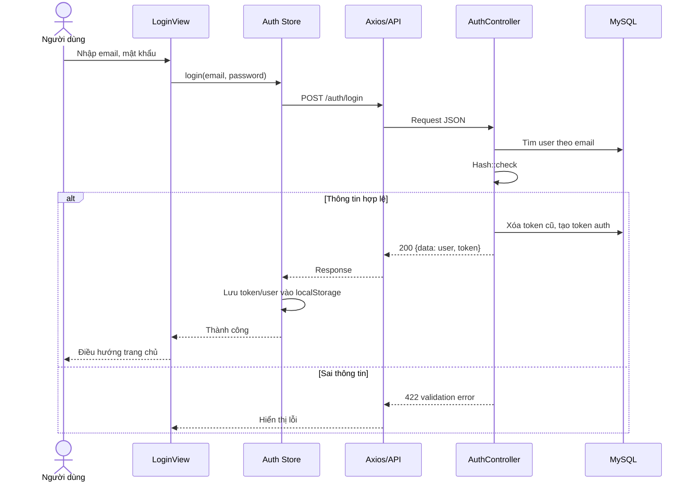

## 5.2. Biểu đồ trình tự cập nhật sở thích

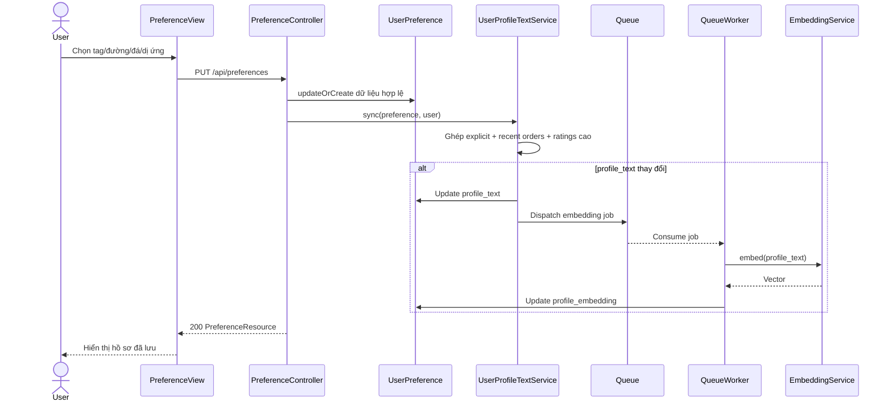

## 5.3. Biểu đồ trình tự đặt hàng

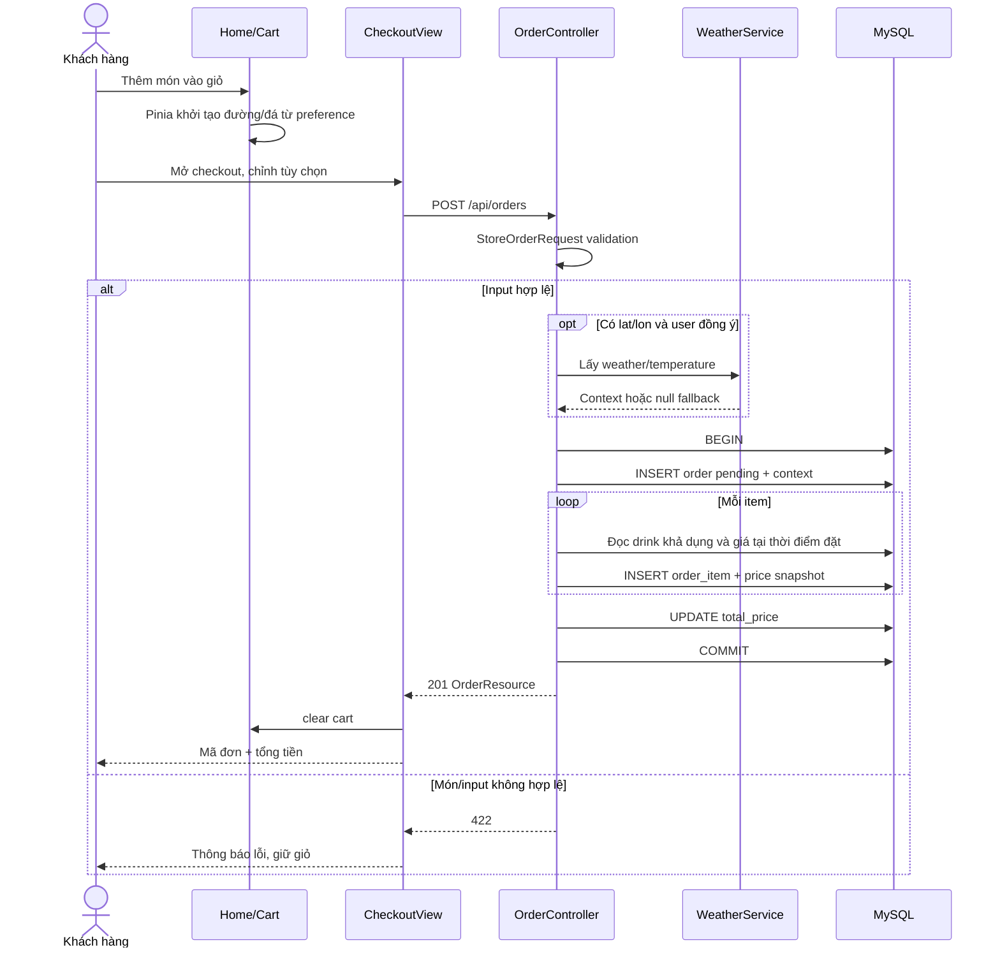

## 5.4. Biểu đồ trình tự hủy và xử lý đơn

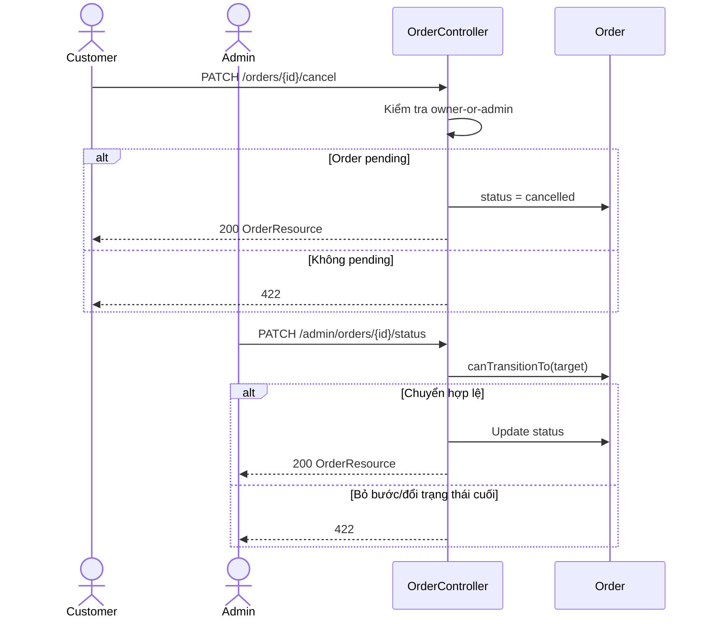

## 5.5. Biểu đồ trình tự đánh giá

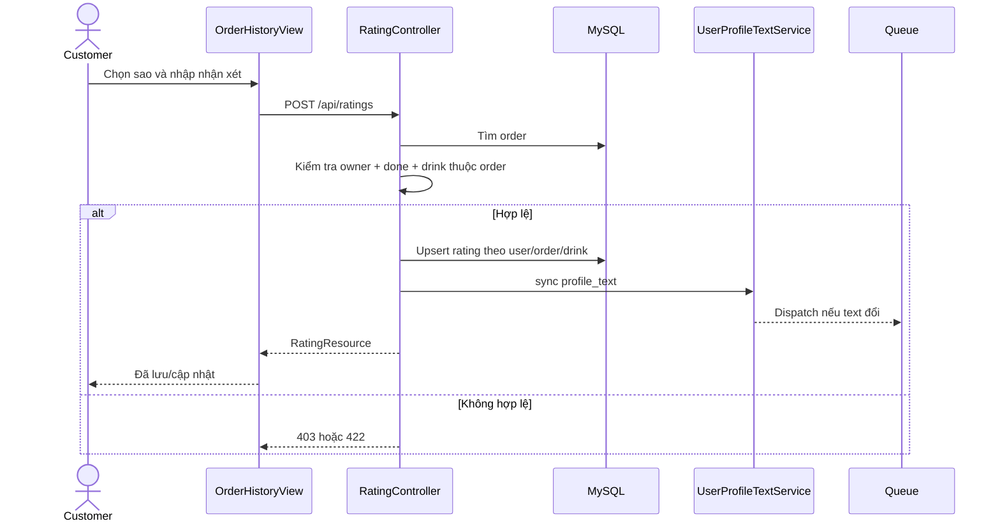

## 5.6. Biểu đồ trình tự báo cáo

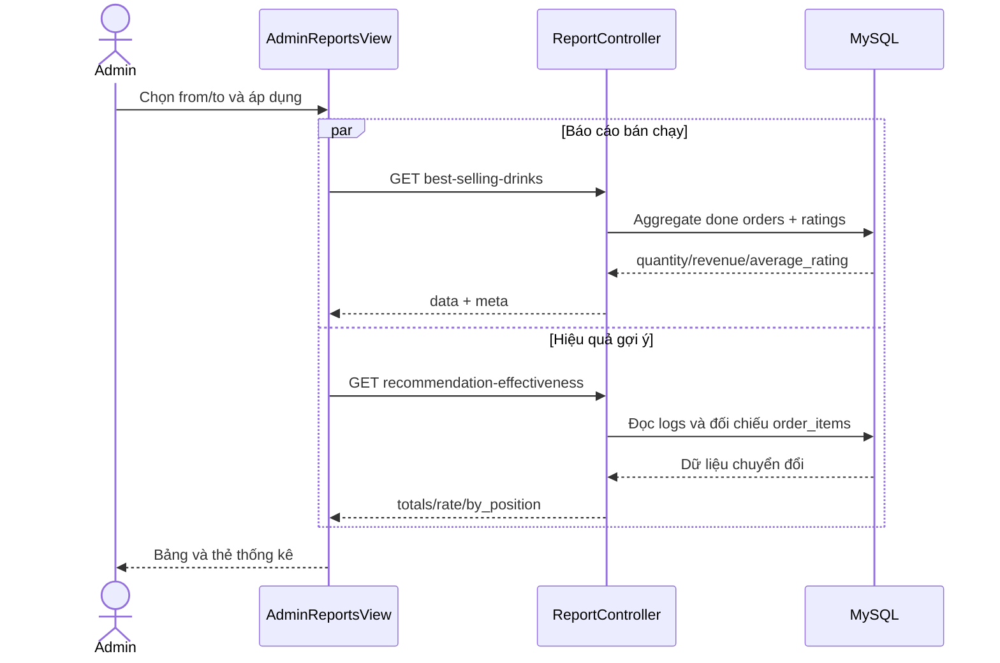

## 5.7. Biểu đồ trình tự recommendation

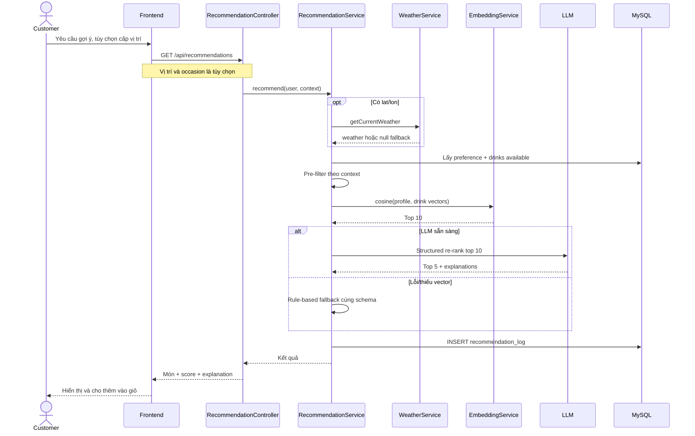

## 5.8. Biểu đồ hoạt động đặt hàng

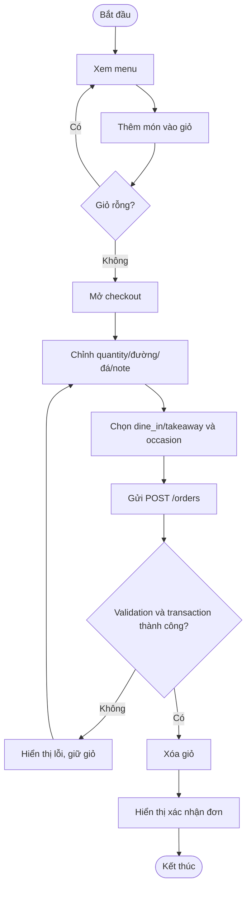

## 5.9. Biểu đồ hoạt động quản lý trạng thái đơn

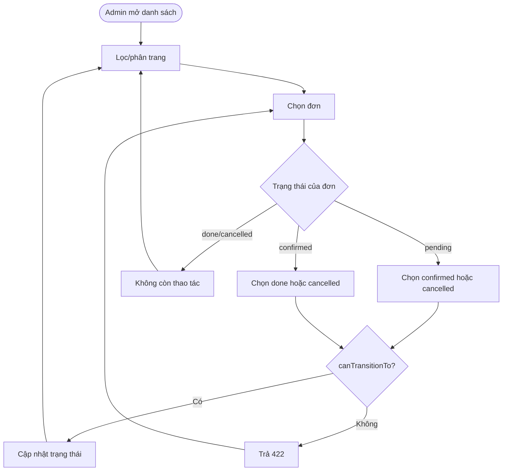

## 5.10. Biểu đồ trạng thái đơn hàng

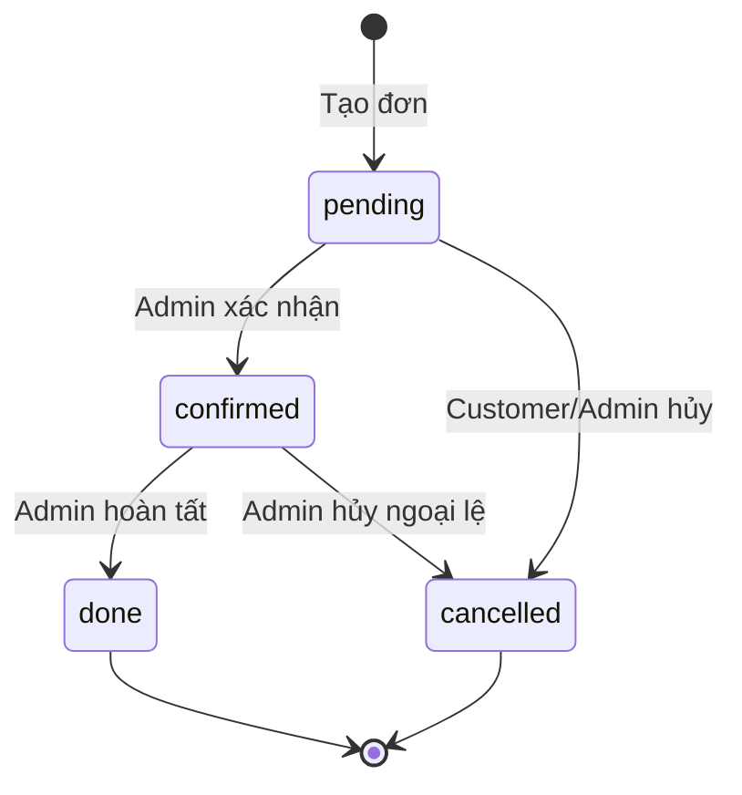

Không có chuyển trạng thái ngược; không cho phép `pending → done`.

## 5.11. Biểu đồ trạng thái tài khoản/phiên

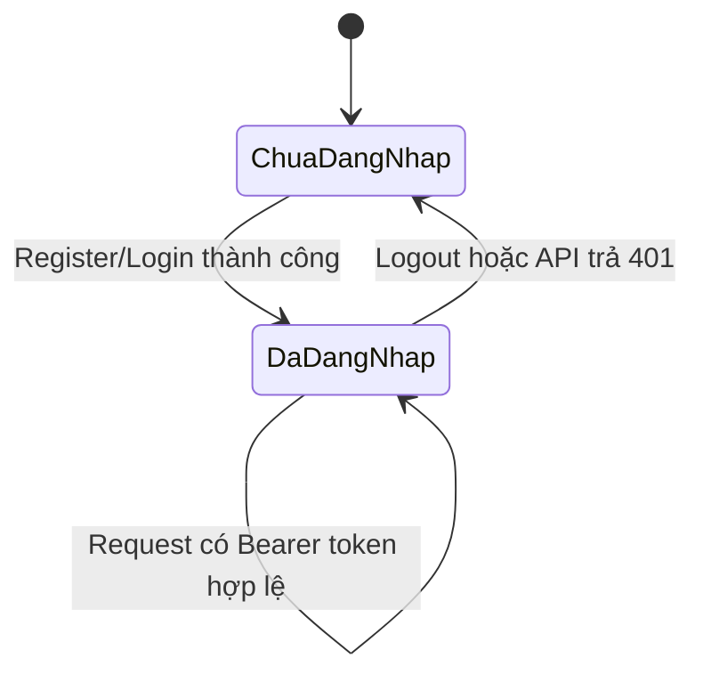

Trong phạm vi phiên bản này, mô hình tài khoản chỉ xét trạng thái có hoặc không có phiên hợp lệ. Khóa tài khoản và xác minh email được để ngoài phạm vi.
