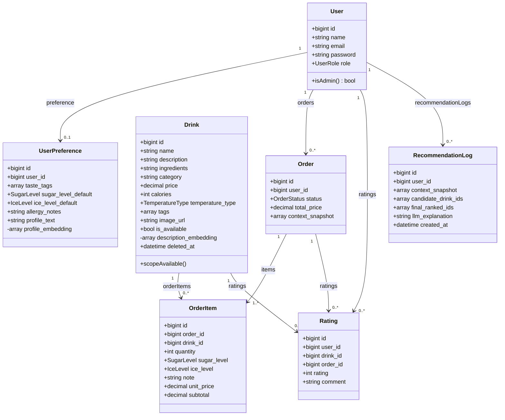
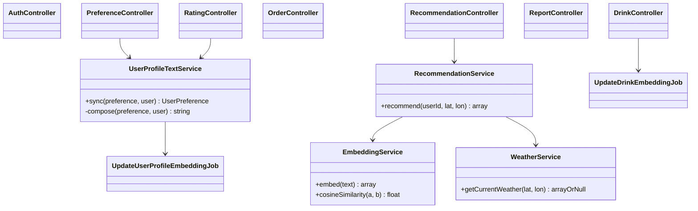
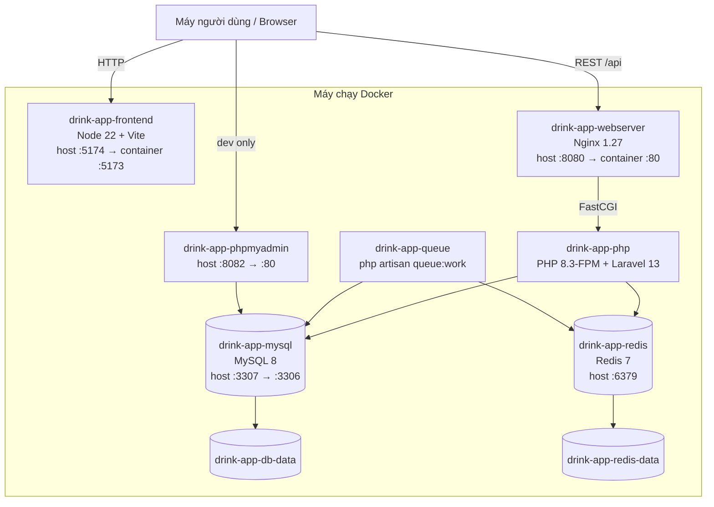
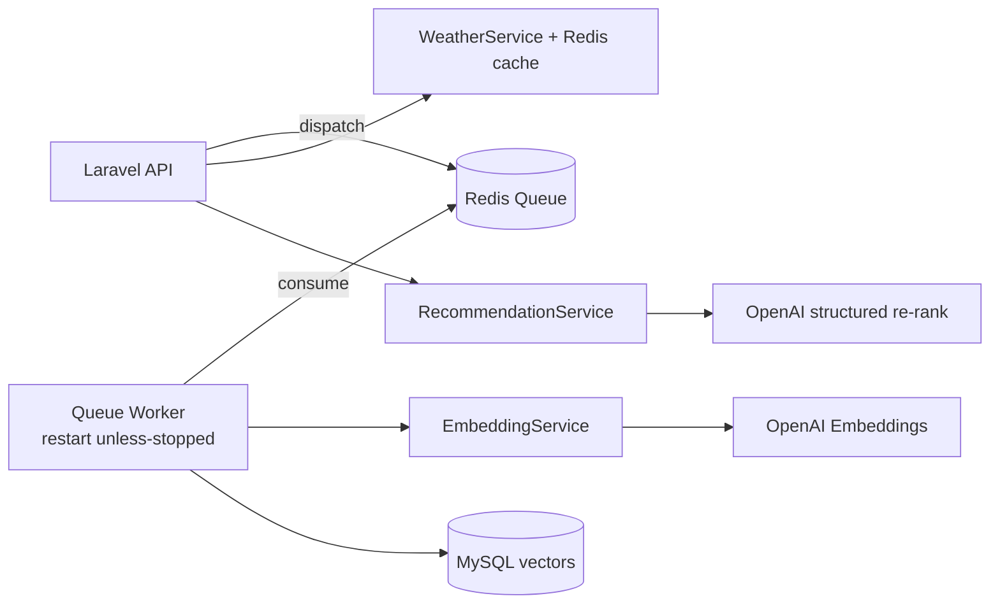

# 06. Thiết kế lớp và triển khai

## 6.1. Biểu đồ lớp miền nghiệp vụ

Vector embedding phải được ẩn khỏi JSON Resource. Model `RecommendationLog` không dùng `updated_at` để phù hợp mô hình append-only.

## 6.2. Các lớp điều khiển và dịch vụ

Các controller chỉ điều phối HTTP. Logic tổng hợp profile, embedding, weather và recommendation phải nằm trong service; hai job gọi `EmbeddingService` qua queue worker.

## 6.3. Biểu đồ triển khai Docker đề xuất

Các cổng là cấu hình môi trường phát triển đề xuất và có thể đổi qua `.env`. MySQL/Redis chỉ nên mở cổng host trong môi trường dev; production không công khai các cổng dữ liệu.

## 6.4. Thành phần triển khai và trách nhiệm

| Thành phần | Image/build | Trách nhiệm | Phụ thuộc |
|---|---|---|---|
| `frontend` | Dockerfile Node | Chạy Vite dev server, phục vụ Vue SPA. | Backend URL qua `VITE_API_BASE_URL`. |
| `webserver` | `nginx:1.27-alpine` | Nhận HTTP và chuyển PHP request tới PHP-FPM. | `app`. |
| `app` | Dockerfile PHP | Laravel API, migration, import demo, dispatch job. | MySQL và Redis healthy. |
| `queue` | Cùng image PHP | Consume Redis queue, tạo embedding, retry/backoff. | MySQL, Redis và dịch vụ OpenAI. |
| `db` | `mysql:8.0` | Dữ liệu giao dịch bền vững. | Named volume. |
| `redis` | `redis:7-alpine` | Cache/session/queue theo env Docker. | Named volume, AOF bật. |
| `phpmyadmin` | `phpmyadmin:5` | Công cụ dev quản trị MySQL. | `db`. |

## 6.5. Yêu cầu triển khai

- Docker Compose phải có queue worker riêng, `restart: unless-stopped`, cùng code/config với API.
- MySQL và Redis có healthcheck; API, webserver, frontend và worker nên có kiểm tra sẵn sàng phù hợp.
- `config/services.php` ánh xạ rõ OpenAI/Weather từ biến môi trường; `.env.example` chỉ chứa tên biến và giá trị rỗng/mẫu.
- Không commit secret; production dùng secret manager hoặc cơ chế inject biến môi trường.
- Worker cấu hình số lần thử, backoff và `failed_jobs`; log không chứa API key/profile nhạy cảm.
- Dữ liệu MySQL/Redis dùng named volume; có chính sách backup/restore cho MySQL.
- Production dùng TLS, build frontend tĩnh và không công khai phpMyAdmin.
- Mọi tài liệu, Docker image và dependency phải thống nhất Laravel 13.

## 6.6. Luồng triển khai recommendation

Worker phải được cấu hình restart policy, retry/backoff và log không chứa secret/input nhạy cảm. API recommendation vẫn cần fallback khi mọi tích hợp ngoài không khả dụng.
