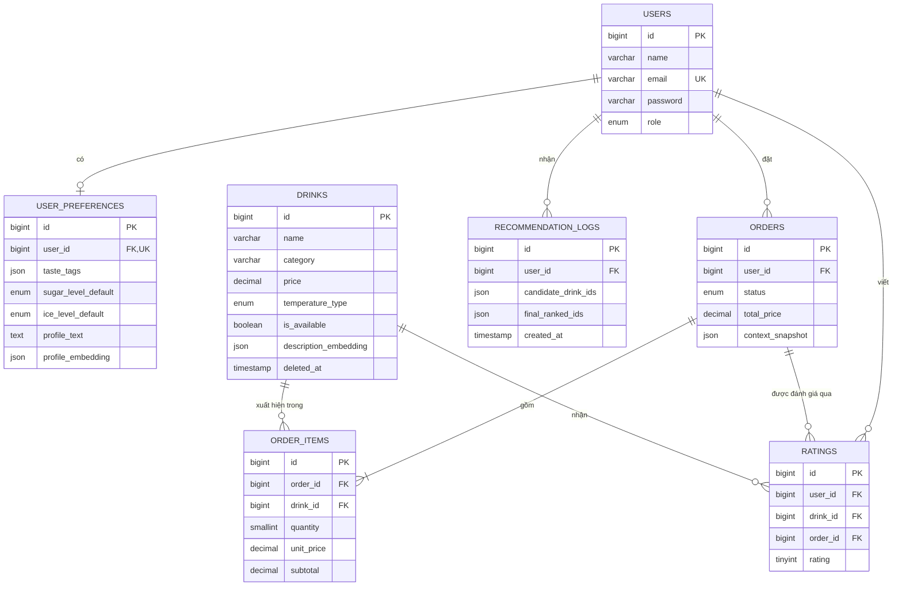

# 07. Thiết kế cơ sở dữ liệu

## 7.1. Tổng quan

Hệ thống dùng MySQL làm nguồn dữ liệu bền vững. Bảy bảng nghiệp vụ là `users`, `user_preferences`, `drinks`, `orders`, `order_items`, `ratings`, `recommendation_logs`. Vector được lưu ở cột JSON và không có vector database riêng. Redis không thay thế MySQL, chỉ được định hướng dùng cho cache/queue.

Ngoài các bảng nghiệp vụ, Laravel còn có bảng framework như `password_reset_tokens`, `sessions`, `personal_access_tokens`, `cache`, `cache_locks`, `jobs`, `job_batches`, `failed_jobs`.

## 7.2. Sơ đồ quan hệ dữ liệu



## 7.3. Bảng `users`

| Cột | Kiểu | Null/Default | Ràng buộc và ý nghĩa |
|---|---|---|---|
| `id` | BIGINT UNSIGNED | NO, auto increment | PK. |
| `name` | VARCHAR(255) | NO | Tên hiển thị. |
| `email` | VARCHAR(255) | NO | UNIQUE, email đăng nhập. |
| `email_verified_at` | TIMESTAMP | NULL | Dành cho mở rộng xác minh email; ngoài phạm vi use case phiên bản đầu. |
| `password` | VARCHAR(255) | NO | Model cast `hashed`. |
| `role` | ENUM(`customer`,`admin`) | NO, `customer` | INDEX, phân quyền. |
| `remember_token` | VARCHAR(100) | NULL | Trường Laravel. |
| `created_at`, `updated_at` | TIMESTAMP | NULL | Timestamps. |

Quan hệ: `hasOne user_preferences`; `hasMany orders`, `ratings`, `recommendation_logs`.

## 7.4. Bảng `user_preferences`

| Cột | Kiểu | Null/Default | Ràng buộc và ý nghĩa |
|---|---|---|---|
| `id` | BIGINT UNSIGNED | NO, auto increment | PK. |
| `user_id` | BIGINT UNSIGNED | NO | FK → `users.id`, UNIQUE, ON DELETE CASCADE. |
| `taste_tags` | JSON | NULL | Mảng tag sở thích. |
| `sugar_level_default` | ENUM(`0`,`30`,`50`,`70`,`100`) | `100` | Đường mặc định. |
| `ice_level_default` | ENUM(`no_ice`,`less_ice`,`normal_ice`,`extra_ice`) | `normal_ice` | Đá mặc định. |
| `allergy_notes` | TEXT | NULL | Ghi chú dị ứng. |
| `profile_text` | TEXT | NULL | Văn bản tổng hợp dùng để embed. |
| `profile_embedding` | JSON | NULL | Vector do queued job sinh; phải ẩn khỏi API. |
| `created_at`, `updated_at` | TIMESTAMP | NULL | Timestamps. |

Quy tắc: một user tối đa một hồ sơ. Xóa user làm xóa hồ sơ phụ thuộc.

## 7.5. Bảng `drinks`

| Cột | Kiểu | Null/Default | Ràng buộc và ý nghĩa |
|---|---|---|---|
| `id` | BIGINT UNSIGNED | NO, auto increment | PK. |
| `name` | VARCHAR(255) | NO | Tên món. |
| `description` | TEXT | NULL | Mô tả. |
| `ingredients` | TEXT | NULL | Nguyên liệu dạng văn bản. |
| `category` | VARCHAR(100) | NO | INDEX; không có bảng category riêng. |
| `price` | DECIMAL(10,2) | NO | Giá niêm yết của món. |
| `calories` | INT UNSIGNED | NULL | Năng lượng. |
| `temperature_type` | ENUM(`hot`,`cold`,`both`) | `both` | INDEX, phục vụ pre-filter recommendation. |
| `tags` | JSON | NULL | Mảng tag. |
| `image_url` | VARCHAR(255) | NULL | URL/path ảnh; upload file nằm ngoài phạm vi phiên bản. |
| `is_available` | BOOLEAN | `true` | INDEX; ẩn tạm khỏi menu/order. |
| `description_embedding` | JSON | NULL | Vector do queued job sinh; phải ẩn khỏi API. |
| `created_at`, `updated_at` | TIMESTAMP | NULL | Timestamps. |
| `deleted_at` | TIMESTAMP | NULL | INDEX, soft delete. |

Quan hệ: `hasMany order_items`, `ratings`. Public query đồng thời chịu global soft-delete scope và `is_available=true`.

## 7.6. Bảng `orders`

| Cột | Kiểu | Null/Default | Ràng buộc và ý nghĩa |
|---|---|---|---|
| `id` | BIGINT UNSIGNED | NO, auto increment | PK. |
| `user_id` | BIGINT UNSIGNED | NO | FK → `users.id`, ON DELETE RESTRICT. |
| `status` | ENUM(`pending`,`confirmed`,`done`,`cancelled`) | `pending` | INDEX. |
| `total_price` | DECIMAL(10,2) | NO | Snapshot tổng subtotal. |
| `context_snapshot` | JSON | NULL | Giờ, weather, temperature, order type, occasion, lat/lon. |
| `created_at` | TIMESTAMP | NULL | INDEX, thời điểm tạo. |
| `updated_at` | TIMESTAMP | NULL | Thời điểm cập nhật gần nhất. |

Cấu trúc JSON được thiết kế:

```json
{
  "hour": 15,
  "weather": null,
  "temperature": null,
  "order_type": "dine_in",
  "occasion": "sau khi tập gym",
  "lat": null,
  "lon": null
}
```

`weather`, `temperature`, `lat` và `lon` được phép null khi user không cấp vị trí hoặc dịch vụ thời tiết lỗi. Nếu lưu lat/lon, application phải làm tròn tối đa hai chữ số thập phân trước khi tạo snapshot. Quan hệ: `belongsTo user`; `hasMany items`, `ratings`.

## 7.7. Bảng `order_items`

| Cột | Kiểu | Null/Default | Ràng buộc và ý nghĩa |
|---|---|---|---|
| `id` | BIGINT UNSIGNED | NO, auto increment | PK. |
| `order_id` | BIGINT UNSIGNED | NO | FK → `orders.id`, ON DELETE CASCADE. |
| `drink_id` | BIGINT UNSIGNED | NO | FK → `drinks.id`, ON DELETE RESTRICT. |
| `quantity` | SMALLINT UNSIGNED | `1` | API giới hạn 1–20. |
| `sugar_level` | ENUM(`0`,`30`,`50`,`70`,`100`) | `100` | Snapshot tùy chọn. |
| `ice_level` | ENUM(`no_ice`,`less_ice`,`normal_ice`,`extra_ice`) | `normal_ice` | Snapshot tùy chọn. |
| `note` | VARCHAR(255) | NULL | Ghi chú từng món. |
| `unit_price` | DECIMAL(10,2) | NO | Giá tại lúc đặt. |
| `subtotal` | DECIMAL(10,2) | NO | `unit_price × quantity`. |
| `created_at`, `updated_at` | TIMESTAMP | NULL | Timestamps. |

Không thiết kế trường `size` trong phiên bản đầu; mỗi món có một giá niêm yết. Nếu bổ sung size phải thêm enum/bảng giá, snapshot size/phụ thu và cập nhật toàn bộ API/UI.

## 7.8. Bảng `ratings`

| Cột | Kiểu | Null/Default | Ràng buộc và ý nghĩa |
|---|---|---|---|
| `id` | BIGINT UNSIGNED | NO, auto increment | PK. |
| `user_id` | BIGINT UNSIGNED | NO | FK → `users.id`, RESTRICT. |
| `drink_id` | BIGINT UNSIGNED | NO | FK → `drinks.id`, RESTRICT. |
| `order_id` | BIGINT UNSIGNED | NO | FK → `orders.id`, RESTRICT. |
| `rating` | TINYINT UNSIGNED | NO | CHECK 1–5 trên MySQL; API cũng validation. |
| `comment` | TEXT | NULL | Nhận xét, API tối đa 2000 ký tự. |
| `created_at`, `updated_at` | TIMESTAMP | NULL | Hỗ trợ cập nhật đánh giá. |

UNIQUE `(user_id, order_id, drink_id)` bảo đảm một đánh giá cho một món trong một đơn; controller upsert thay vì tạo trùng.

## 7.9. Bảng `recommendation_logs`

| Cột | Kiểu | Null/Default | Ràng buộc và ý nghĩa |
|---|---|---|---|
| `id` | BIGINT UNSIGNED | NO, auto increment | PK. |
| `user_id` | BIGINT UNSIGNED | NO | FK → `users.id`, RESTRICT, INDEX. |
| `context_snapshot` | JSON | NULL | Ngữ cảnh lượt gợi ý. |
| `candidate_drink_ids` | JSON | NULL | Danh sách ứng viên có thứ tự. |
| `final_ranked_ids` | JSON | NULL | Danh sách sau re-rank có thứ tự. |
| `llm_explanation` | TEXT | NULL | Văn bản hoặc chuỗi JSON ánh xạ giải thích. |
| `created_at` | TIMESTAMP | NULL | INDEX. |

Không có `updated_at`; log là append-only và được tạo sau mỗi lượt recommendation sinh được kết quả.

## 7.10. Ràng buộc toàn vẹn và lý do thiết kế

| Quyết định | Lý do |
|---|---|
| `user_preferences.user_id` unique + cascade | Hồ sơ phụ thuộc và quan hệ 1–1 với user. |
| FK giao dịch/rating/log restrict | Bảo toàn lịch sử và dữ liệu phân tích. |
| `orders → order_items` cascade | Item không có ý nghĩa khi order bị xóa. |
| Soft delete `drinks` | Giữ tham chiếu lịch sử nhưng ẩn món khỏi query thường. |
| Snapshot `unit_price`, `subtotal`, `total_price` | Giá menu thay đổi không làm sai đơn cũ. |
| JSON cho tags/context/vector/ranking | Phù hợp dữ liệu bán cấu trúc và quy mô đồ án. |
| Enum thống nhất | Chặn giá trị ngoài hợp đồng ở DB và application. |

## 7.11. Quy tắc ánh xạ Eloquent

- Các field JSON được cast thành array trong model.
- `status`, `role`, đường, đá và nhiệt độ được cast sang PHP backed enum.
- `price`, `unit_price`, `subtotal`, `total_price` được cast decimal 2 chữ số.
- Hai vector được hidden để không truyền dữ liệu lớn ra Resource.
- `Drink` dùng `SoftDeletes` và scope `available()`.
