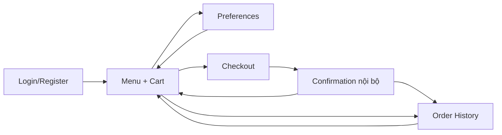

# 08. Thiết kế API, giao diện và an toàn hệ thống

## 8.1. Quy ước REST API

- Base URL mặc định từ frontend: `http://localhost:8080/api`.
- Payload và response dùng JSON, tên field theo `snake_case`.
- Route bảo vệ nhận `Authorization: Bearer <sanctum_token>`.
- Laravel Resource phải bọc payload trong `{ "data": ... }`; collection phân trang có thêm `links` và `meta`.
- Register/login trả `token` ở top-level cạnh `data`.
- Validation lỗi trả HTTP 422; thiếu xác thực 401; thiếu quyền 403; không tìm thấy 404.
- Vector embedding bị ẩn khỏi response.

## 8.2. API xác thực và public

| Method | Endpoint | Auth | Request/tùy chọn | Response/hành vi |
|---|---|---|---|---|
| POST | `/api/auth/register` | Public | `name`, `email`, `password`, `password_confirmation` | 201, tạo customer và token. |
| POST | `/api/auth/login` | Public | `email`, `password` | 200, xóa token cũ và cấp token mới. |
| POST | `/api/auth/logout` | User | — | 200, xóa toàn bộ token user. |
| GET | `/api/auth/me` | User | — | 200, `id`, `name`, `email`, `role`. |
| GET | `/api/drinks` | Public | Query tùy chọn `category` | Danh sách món available, chưa xóa, sắp xếp tên. |
| GET | `/api/drinks/{drink}` | Public | Path `drink` | Chi tiết món; unavailable trả 404. |

### 8.2.1. Validation register/login

| Field | Quy tắc |
|---|---|
| `name` | Required, string, tối đa 255. |
| `email` | Required, email; register tối đa 255 và unique. |
| `password` | Register required, string, tối thiểu 8, phải confirmed; login chỉ required string. |

## 8.3. API customer/authenticated

| Method | Endpoint | Chức năng | Input chính |
|---|---|---|---|
| GET | `/api/preferences` | Xem preference hoặc default ảo. | — |
| PUT | `/api/preferences` | Tạo/cập nhật preference và profile text. | `taste_tags[]`, `sugar_level_default`, `ice_level_default`, `allergy_notes`. |
| GET | `/api/recommendations` | Nhận gợi ý cá nhân hóa. | Optional `lat`, `lon`, `occasion`. |
| POST | `/api/orders` | Tạo đơn và snapshot. | `items[]`; optional `order_type`, `occasion`, `lat`, `lon`. |
| GET | `/api/orders/history` | Lịch sử của user. | Laravel pagination, 10/trang. |
| GET | `/api/orders/{order}` | Chi tiết order của owner hoặc admin. | Path id. |
| PATCH | `/api/orders/{order}/cancel` | Customer hủy order `pending`. | — |
| GET | `/api/ratings` | Toàn bộ rating của user đang đăng nhập. | — |
| POST | `/api/ratings` | Tạo/cập nhật rating hợp lệ. | `order_id`, `drink_id`, `rating`, optional `comment`. |

### 8.3.1. Contract tạo đơn

```json
{
  "items": [
    {
      "drink_id": 12,
      "quantity": 2,
      "sugar_level": "70",
      "ice_level": "normal_ice",
      "note": "ít ngọt"
    }
  ],
  "order_type": "takeaway",
  "occasion": "sau khi tập gym",
  "lat": 10.7769,
  "lon": 106.7009
}
```

Validation quan trọng:

- `items` required, array, tối thiểu 1.
- `drink_id` phải tồn tại, available và chưa soft-delete.
- `quantity` từ 1 đến 20.
- `sugar_level` và `ice_level` phải thuộc enum.
- `note` tối đa 255; `occasion` tối đa 100.
- `order_type` là `dine_in` hoặc `takeaway`.
- `lat` trong [-90, 90], `lon` trong [-180, 180].

Response `OrderResource` chứa `id`, `status`, `total_price`, `context_snapshot`, `items`, optional `user`, `created_at`, `updated_at`. Giá response dạng decimal string do Eloquent cast.

### 8.3.2. Contract rating

- `order_id` và `drink_id` phải tồn tại.
- `rating` integer 1–5; `comment` tối đa 2000.
- Controller kiểm tra thêm owner, order `done` và món thuộc order.

## 8.4. API admin

Toàn bộ endpoint dưới đây dùng middleware `auth:sanctum` và `role:admin`.

| Method | Endpoint | Chức năng |
|---|---|---|
| GET | `/api/admin/drinks` | Danh sách món chưa soft-delete, gồm cả unavailable; optional category. |
| GET | `/api/admin/drinks/{drink}` | Chi tiết món. |
| POST | `/api/admin/drinks` | Tạo món, dispatch job embedding. |
| PUT | `/api/admin/drinks/{drink}` | Cập nhật món; có thể dispatch job. |
| DELETE | `/api/admin/drinks/{drink}` | Soft-delete, trả 204. |
| GET | `/api/admin/orders` | Danh sách 15/trang; optional `status`, `user_id`. |
| GET | `/api/admin/orders/{order}` | Chi tiết cùng thông tin customer. |
| PATCH | `/api/admin/orders/{order}/status` | Chuyển trạng thái hợp lệ. |
| GET | `/api/admin/reports/best-selling-drinks` | Optional `from`, `to`, `limit`; mặc định limit 10, trần 50. |
| GET | `/api/admin/reports/recommendation-effectiveness` | Optional `from`, `to`, `window_hours`, `limit`; mặc định 24 giờ/500 log. |

### 8.4.1. Contract đồ uống

| Field | Create | Update | Quy tắc |
|---|---|---|---|
| `name` | Required | Sometimes required | String, max 255. |
| `description` | Optional | Sometimes | Nullable string. |
| `ingredients` | Optional | Sometimes | Nullable string. |
| `category` | Required | Sometimes required | String, max 100. |
| `price` | Required | Sometimes required | Numeric, min 0. |
| `calories` | Optional | Sometimes | Nullable integer, min 0. |
| `temperature_type` | Required | Sometimes required | `hot`, `cold`, `both`. |
| `tags` | Optional | Sometimes | Nullable array string, mỗi tag max 50. |
| `image_url` | Optional | Sometimes | Nullable URL/path string, max 255. |
| `is_available` | Optional | Sometimes | Boolean. |

### 8.4.2. Response báo cáo

Best-selling trả mỗi dòng:

```json
{
  "drink_id": 12,
  "drink_name": "Trà đào cam sả",
  "drink_category": "trà trái cây",
  "total_quantity": 20,
  "average_rating": 4.5,
  "total_revenue": 900000
}
```

Chỉ order `done` được tính quantity/revenue. Rating trung bình lọc theo `ratings.created_at` trong khoảng thời gian báo cáo.

Effectiveness trả:

```json
{
  "total_recommendations": 10,
  "converted_recommendations": 3,
  "conversion_rate": 30.0,
  "conversion_by_position": {
    "0": 2,
    "2": 1
  }
}
```

## 8.5. Hợp đồng API recommendation

`GET /api/recommendations` là route authenticated. Form Request kiểm tra: `lat` trong [-90, 90], `lon` trong [-180, 180], hai tọa độ phải cùng có hoặc cùng thiếu; `occasion` nullable string tối đa 100 ký tự.

```json
{
  "data": [
    {
      "drink": {
        "id": 12,
        "name": "Trà đào cam sả",
        "price": "45000.00"
      },
      "score": 0.87,
      "explanation": "Phù hợp với khẩu vị trái cây và thời tiết nóng."
    }
  ],
  "meta": {
    "strategy": "llm_rerank",
    "context": {
      "hour": 15,
      "weather": "sunny",
      "temperature": 34.5,
      "occasion": "sau khi tập gym"
    },
    "fallback": false
  }
}
```

Fallback phải giữ cùng response shape, chỉ đổi `strategy` thành `rule_based`, `popular` hoặc `context_only`, đặt `fallback=true` và cho phép weather/temperature là null. `score` phải được chuẩn hóa trong khoảng 0–1; `explanation` tối đa hai câu và không đưa ra khẳng định sức khỏe.

## 8.6. Thiết kế giao diện

### 8.6.1. Router và quyền truy cập

| URL | View | Guard | Chức năng |
|---|---|---|---|
| `/login` | `LoginView` | Guest | Đăng nhập. |
| `/register` | `RegisterView` | Guest | Đăng ký customer. |
| `/` | `HomeView` | Auth | Welcome, kết quả recommendation, menu và cart sidebar. |
| `/preferences` | `PreferenceView` | Auth | Chỉnh sở thích và xem profile text. |
| `/checkout` | `CheckoutView` | Auth + giỏ không rỗng | Chỉnh item, loại nhận, payment minh họa, tạo/xác nhận đơn. |
| `/orders` | `OrderHistoryView` | Auth | Lịch sử, hủy và rating. |
| `/admin/menu` | `AdminMenuView` | Admin | Quản lý menu. |
| `/admin/orders` | `AdminOrdersView` | Admin | Lọc/phân trang và xử lý đơn. |
| `/admin/reports` | `AdminReportsView` | Admin | Best-seller và effectiveness. |

API menu được để public để có thể tái sử dụng cho trang giới thiệu hoặc client khác; SPA chính yêu cầu đăng nhập trước khi vào Home vì giỏ, preference và recommendation gắn với user.

### 8.6.2. Luồng màn hình customer



### 8.6.3. Design system

- Primary caramel `#b45309`, nền kem `#faf6f0`, text nâu `#3f2a1d`.
- Font body Inter; heading/logo Poppins.
- Card bo 16px, input/nút thường bo 10–12px; focus ring màu amber.
- Component tái sử dụng: `AppNavbar`, `AppLogo`, `BaseButton`, `BaseCard`, `FormField`, `RadioCard`, `SectionHeader`, `ProgressSteps`.
- Trạng thái order có màu riêng: pending vàng nhạt, confirmed xanh dương, done xanh lá, cancelled đỏ.
- Layout responsive: menu chuyển từ 3 cột về dọc; cart/summary sticky tại breakpoint phù hợp.

### 8.6.4. Trạng thái và quy tắc UX bắt buộc

- Khu vực recommendation có loading skeleton, kết quả, fallback, lỗi có nút thử lại và trạng thái không có món.
- Trước khi xin vị trí, UI giải thích mục đích; từ chối quyền vẫn tải gợi ý không có weather.
- Mỗi món gợi ý hiển thị tên, giá, score/nhãn phù hợp, explanation và nút thêm giỏ.
- Customer order history có pagination; rating state được giữ đúng khi chuyển trang.
- Cart dùng preference làm giá trị đường/đá ban đầu, sau đó user có thể ghi đè từng item.
- Cart tồn tại trong phiên Pinia; persistence qua reload không thuộc phạm vi phiên bản đầu.
- Payment cash/QR chỉ là mô phỏng và không được gửi như giao dịch tài chính.
- Checkout gửi lat/lon chỉ khi user đồng ý; order context cho phép null.
- Size, upload ảnh, quản lý user và đổi/quên mật khẩu nằm ngoài phạm vi phiên bản đầu.

## 8.7. Xác thực, phân quyền và bảo vệ dữ liệu

### 8.7.1. Cơ chế phải triển khai

- Sanctum personal access token bảo vệ API.
- Password phải hash tự động; password và remember token bị ẩn khỏi JSON.
- Middleware role dùng enum và trả 403 nếu không đúng admin.
- Order controller kiểm tra owner hoặc admin; rating kiểm tra owner.
- Form Request giới hạn enum, số lượng, tọa độ và độ dài text.
- Transaction đảm bảo order và items nhất quán.
- Resource không trả `profile_embedding`/`description_embedding`.
- API trả JSON lỗi cho path `api/*`.

### 8.7.2. Quyết định an toàn

- Phiên bản đầu dùng chiến lược một phiên hoạt động: login mới/logout thu hồi các token cũ của user.
- Nếu lưu token ở `localStorage`, frontend phải có CSP, không render HTML không tin cậy và tránh phụ thuộc vào user cache để phân quyền.
- Admin report/order query phải validation ngày, status, limit và window dương trước query.
- Tích hợp ngoài phải cấu hình qua `config/services.php`, timeout/retry và log an toàn.
- Không log API key, password, vector đầy đủ hoặc nội dung profile nhạy cảm.
- Tọa độ dùng để lấy thời tiết; nếu ghi vào snapshot phải làm tròn tối đa hai chữ số thập phân, không đưa tọa độ chính xác vào log ứng dụng.
- Ảnh món dùng URL/path đã kiểm tra và có placeholder; upload nằm ngoài phạm vi.
- Áp dụng rate limiting riêng cho login, recommendation và endpoint tốn chi phí.

## 8.8. Yêu cầu hiệu năng và độ tin cậy

| Mục tiêu | Giải pháp thiết kế |
|---|---|
| Recommendation 2–3 giây | Timeout tổng, cache context và fallback nếu LLM chậm/lỗi. |
| Tránh N+1 | Eager load `items.drink`; report dùng aggregate/subquery. |
| Tối ưu AI cost | Pre-filter → cosine top 10 → LLM top 5. |
| Cache weather | Redis TTL khoảng 30 phút theo tọa độ làm tròn và time bucket. |
| Không tính lại vector | Dispatch khi `name/description/ingredients/tags` hoặc `profile_text` đổi. |
| Khả năng phục hồi | Restart policy, healthcheck, worker retry/backoff và failed jobs. |
| Nhất quán giao dịch | Tạo order bằng DB transaction và snapshot giá. |

## 8.9. Kế hoạch kiểm thử trước khi lập trình

| Nhóm | Phạm vi bắt buộc |
|---|---|
| Backend feature | Auth, authorization, validation, preference 1–1, menu availability, order transaction/snapshot, ownership/cancel, rating eligibility, admin state transition và report. |
| Backend unit | Cosine với vector hợp lệ/rỗng/khác chiều/zero norm; profile composition; order state machine; date/window validation. |
| Integration fake | OpenAI embedding/re-rank, Weather API, Redis cache và queued jobs đều dùng fake, không gọi mạng trong test. |
| Frontend component/store | Auth/cart store; menu/filter; recommendation states; checkout; pagination/rating; admin action buttons. |
| E2E | Register/login → preference → recommendation/menu → cart → checkout → history; admin menu → order → report. |

Mỗi use case phải có happy path, permission/validation và edge case quan trọng. Trước bàn giao phải chạy backend suite, frontend test/lint/build và một luồng E2E tối thiểu.

## 8.10. Ma trận truy vết yêu cầu–thiết kế

| Use case | API/backend dự kiến | UI dự kiến | Dữ liệu | Kiểm thử chấp nhận chính |
|---|---|---|---|---|
| UC-01 | Auth routes/controller/requests | Login/Register | users, personal_access_tokens | Token hợp lệ; sai credentials 422; route riêng tư 401. |
| UC-02 | Preferences + profile service/job | PreferenceView | user_preferences | Một row/user; chỉ embed khi nguồn đổi. |
| UC-03 | Public drinks | Home/menu components | drinks | Chỉ trả món available/chưa xóa. |
| UC-04 | Recommendation request/controller/resource/services | Recommendation results | preferences, drinks, logs | Top 10→5, log đúng thứ tự, fallback cùng schema. |
| UC-05 | POST orders transaction | Cart/Checkout/Confirmation | orders, order_items | Snapshot đúng; rollback khi item lỗi. |
| UC-06 | History/show/cancel | OrderHistory + pagination | orders, order_items | Owner-only; chỉ hủy pending. |
| UC-07 | GET/POST ratings | Rating form | ratings | Chỉ item của order done; upsert unique. |
| UC-08 | Admin drinks CRUD | AdminMenuView | drinks | Role admin; soft delete; refresh embedding. |
| UC-09 | Admin orders/status | AdminOrdersView | orders | Không bỏ bước/đổi trạng thái terminal. |
| UC-10 | Hai report endpoints | AdminReportsView | orders/items/ratings/logs | Best-seller chỉ done; conversion bỏ cancelled. |

## 8.11. Quyết định thiết kế trước khi lập trình

1. Dùng Laravel 13, PHP 8.3, Vue 3, MySQL 8 và Redis 7.
2. Recommendation dùng OpenAI embedding và structured re-rank; provider weather được che sau `WeatherService` để có thể thay thế.
3. Docker Compose bắt buộc có queue worker riêng.
4. Size và upload ảnh nằm ngoài phạm vi; mỗi món có một giá, ảnh dùng URL/path.
5. Implicit profile được cập nhật khi order chuyển `done` và khi rating được tạo/sửa; không học từ order đã hủy.
6. Một recommendation được tính là conversion khi cùng user tạo order không bị `cancelled`, chứa ít nhất một món được gợi ý, trong cửa sổ mặc định 24 giờ.
7. Phiên bản đầu áp dụng single-active-session bằng cách thu hồi token cũ khi login/logout.
8. Payment chỉ mô phỏng; không lưu dữ liệu tài chính hoặc thông tin thanh toán.
