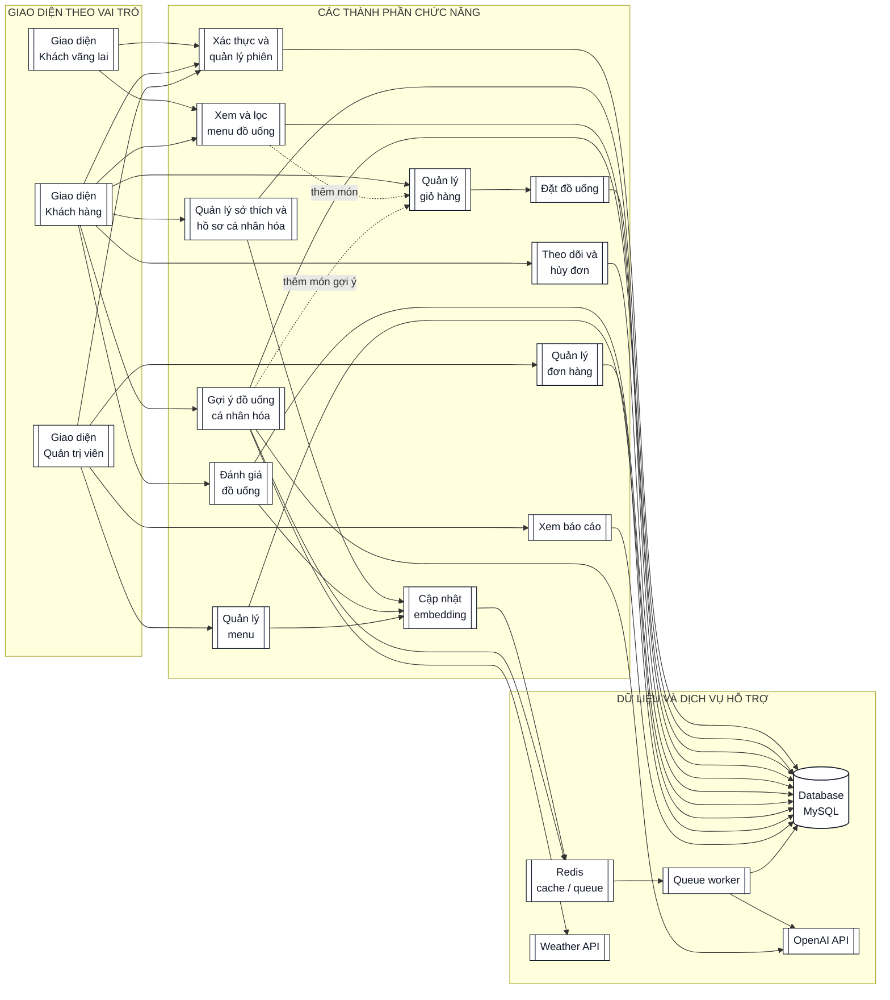

# 09. BIỂU ĐỒ THÀNH PHẦN

## 9.1. Mục đích

Biểu đồ thành phần mô tả các khối phần mềm dự kiến của Smart Drink, giao diện mà mỗi khối cung cấp và quan hệ phụ thuộc. Theo bố cục của tài liệu mẫu, sơ đồ được đọc từ trái sang phải: **giao diện theo vai trò → thành phần chức năng → cơ sở dữ liệu và dịch vụ hỗ trợ**. Cách trình bày này giúp nhìn trực tiếp mỗi vai trò được dùng chức năng nào, đồng thời vẫn giữ đúng ranh giới frontend, backend và hạ tầng.

## 9.2. Biểu đồ thành phần tổng thể

Mũi tên từ giao diện tới thành phần chức năng có nghĩa là giao diện **sử dụng** chức năng qua Vue Router, Pinia và Axios. Mũi tên từ thành phần chức năng tới MySQL/Redis/API ngoài biểu diễn quan hệ **phụ thuộc**; không có giao diện nào truy cập trực tiếp cơ sở dữ liệu. Hai đường nét đứt từ Menu và Recommendation tới Giỏ hàng biểu diễn hành động tùy chọn của người dùng, không phải lời gọi backend trực tiếp.

## 9.3. Giao diện giữa các thành phần

| Thành phần cung cấp | Giao diện | Thành phần sử dụng | Trách nhiệm |
|---|---|---|---|
| Các giao diện theo vai trò | Vue Router, Pinia và Axios wrappers | Người dùng | Hiển thị đúng chức năng theo vai trò; gửi mọi HTTP request qua `services/api.js`. |
| Xác thực và quản lý phiên | `/api/auth/*` | Cả ba giao diện | Đăng ký, đăng nhập, lấy phiên, đăng xuất và phát token Sanctum. |
| Quản lý sở thích và hồ sơ | `/api/preferences` | Giao diện khách hàng, Đánh giá | Lưu sở thích explicit, tổng hợp profile text và yêu cầu cập nhật vector. |
| Xem và lọc menu | `GET /api/drinks`, `GET /api/drinks/{drink}` | Giao diện khách vãng lai/khách hàng, Giỏ hàng, Recommendation | Cung cấp món còn phục vụ, danh mục và chi tiết món. |
| Gợi ý đồ uống cá nhân hóa | `/api/recommendations` | Giao diện khách hàng, Giỏ hàng, Báo cáo | Thu thập context, lọc/xếp hạng, giải thích, fallback và ghi log. |
| Quản lý giỏ hàng | Pinia cart state | Giao diện khách hàng, Đặt đồ uống | Thêm/sửa/xóa món cục bộ và chuẩn bị payload checkout. |
| Đặt đồ uống | `POST /api/orders` | Quản lý giỏ hàng | Kiểm tra món, snapshot giá/context và tạo order trong transaction. |
| Theo dõi và hủy đơn | `GET /api/orders/history`, `GET /api/orders/{order}`, `PATCH /api/orders/{order}/cancel` | Giao diện khách hàng, Đánh giá | Xem lịch sử/chi tiết và chỉ cho hủy đơn `pending` hợp lệ. |
| Đánh giá đồ uống | `/api/ratings` | Giao diện khách hàng, Hồ sơ cá nhân hóa | Kiểm tra món thuộc đơn `done`, upsert rating và kích hoạt đồng bộ hồ sơ. |
| Quản lý menu | `/api/admin/drinks`, `/api/admin/drinks/{drink}` | Giao diện quản trị viên, Embedding | CRUD, bật/tắt phục vụ, xóa mềm và yêu cầu cập nhật vector món. |
| Quản lý đơn hàng | `/api/admin/orders`, `/api/admin/orders/{order}`, `PATCH /api/admin/orders/{order}/status` | Giao diện quản trị viên | Lọc, xem chi tiết và chuyển trạng thái theo state machine. |
| Xem báo cáo | `/api/admin/reports/*` | Giao diện quản trị viên | Tổng hợp món bán chạy và hiệu quả recommendation. |
| Cập nhật embedding | Queue job contract | Hồ sơ, Đánh giá, Quản lý menu | Đưa job vào Redis để worker tạo/cập nhật vector bằng OpenAI. |

## 9.4. Quy tắc phụ thuộc

- Ba hộp giao diện biểu diễn ranh giới truy cập theo vai trò, không phải ba ứng dụng triển khai độc lập; chúng cùng thuộc Vue SPA.
- Frontend chỉ gọi backend qua `services/api.js`; view không gọi Axios hoặc cơ sở dữ liệu trực tiếp.
- Controller điều phối HTTP; validation thuộc Form Request; nghiệp vụ/tích hợp ngoài thuộc Service.
- Recommendation chỉ nhận món available từ Menu và không gửi toàn menu cho LLM.
- Rating có thể yêu cầu Preference đồng bộ profile, nhưng Preference không phụ thuộc Rating Controller.
- Report chỉ đọc dữ liệu nghiệp vụ và recommendation log, không thay đổi order.
- Job được dispatch qua Redis và chỉ queue worker gọi dịch vụ embedding.
- Weather/OpenAI lỗi phải được chặn tại service và trả fallback đúng schema.
- Các component Recommendation, Embedding, queue worker và route `/api/recommendations` là thành phần **dự kiến** của UC-04; sơ đồ không được dùng làm bằng chứng rằng chúng đã được triển khai.

## 9.5. Ánh xạ thành phần với UC

| Nhóm UC | Thành phần chính | Thành phần phối hợp |
|---|---|---|
| UC-01 | Xác thực và quản lý phiên | Các giao diện theo vai trò, MySQL |
| UC-02 | Quản lý sở thích và hồ sơ | Embedding, Redis, Worker, OpenAI, MySQL |
| UC-03 | Xem và lọc menu | Giao diện khách vãng lai/khách hàng, MySQL |
| UC-04 | Gợi ý đồ uống cá nhân hóa | Menu, Hồ sơ, Weather, OpenAI, Redis, MySQL |
| UC-05 | Quản lý giỏ hàng; Đặt đồ uống | Menu, Pinia cart, MySQL |
| UC-06 | Theo dõi và hủy đơn | Giao diện khách hàng, MySQL |
| UC-07 | Đánh giá đồ uống | Theo dõi đơn, Hồ sơ, Embedding, MySQL |
| UC-08 | Quản lý menu | Giao diện quản trị viên, Embedding, Worker, MySQL |
| UC-09 | Quản lý đơn hàng | Giao diện quản trị viên, role middleware, MySQL |
| UC-10 | Xem báo cáo | Đơn hàng, Đánh giá, Recommendation, MySQL |
