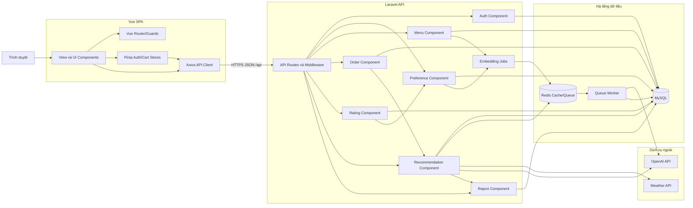

# 09. BIỂU ĐỒ THÀNH PHẦN

## 9.1. Mục đích

Biểu đồ thành phần mô tả các khối phần mềm dự kiến của Smart Drink, giao diện mà mỗi khối cung cấp và quan hệ phụ thuộc. Sơ đồ được dùng để phân chia công việc frontend, backend, dữ liệu và tích hợp ngoài trước khi lập trình.

## 9.2. Biểu đồ thành phần tổng thể

## 9.3. Giao diện giữa các thành phần

| Thành phần cung cấp | Giao diện | Thành phần sử dụng | Trách nhiệm |
|---|---|---|---|
| Vue Router | Route/guard frontend | Views | Điều hướng và kiểm tra phiên để cải thiện UX. |
| Pinia Stores | Auth/cart state | Views | Quản lý phiên cục bộ và giỏ hàng. |
| Axios API Client | HTTP wrapper | Views, Stores | Gắn Bearer token, chuẩn hóa request và xử lý 401. |
| API Routes/Middleware | REST `/api/*` | Axios Client | Định tuyến, xác thực và role guard. |
| Auth Component | Auth API | Routes | Đăng ký, đăng nhập, profile và đăng xuất. |
| Preference Component | Preference/Profile API | Routes, Rating | Sở thích và tổng hợp hồ sơ cá nhân hóa. |
| Menu Component | Public/Admin Drink API | Routes, Recommendation | Danh sách món, CRUD, khả dụng và soft-delete. |
| Order Component | Order API | Routes | Transaction, snapshot giá/context, lịch sử và trạng thái. |
| Rating Component | Rating API | Routes | Kiểm tra điều kiện và upsert đánh giá. |
| Recommendation Component | Recommendation API | Routes, Order, Report | Context, lọc, xếp hạng, giải thích, fallback và log. |
| Report Component | Report API | Routes | Tổng hợp bán chạy và conversion. |
| Embedding Jobs | Queue contract | Preference, Menu | Tạo/cập nhật vector bất đồng bộ. |

## 9.4. Quy tắc phụ thuộc

- Frontend chỉ gọi backend qua `services/api.js`; view không gọi Axios trực tiếp.
- Controller điều phối HTTP; validation thuộc Form Request; nghiệp vụ/tích hợp ngoài thuộc Service.
- Recommendation chỉ nhận món available từ Menu và không gửi toàn menu cho LLM.
- Rating có thể yêu cầu Preference đồng bộ profile, nhưng Preference không phụ thuộc Rating Controller.
- Report chỉ đọc dữ liệu nghiệp vụ và recommendation log, không thay đổi order.
- Job được dispatch qua Redis và chỉ queue worker gọi dịch vụ embedding.
- Weather/OpenAI lỗi phải được chặn tại service và trả fallback đúng schema.

## 9.5. Ánh xạ thành phần với UC

| Nhóm UC | Thành phần chính | Thành phần phối hợp |
|---|---|---|
| UC-01 | Auth | Routes, MySQL, Auth Store |
| UC-02 | Preference | Jobs, Redis, Worker, OpenAI |
| UC-03 | Menu | Axios Client, MySQL |
| UC-04 | Recommendation | Preference, Menu, Weather, OpenAI, Redis |
| UC-05 | Order | Cart Store, Menu, MySQL |
| UC-06 | Order | MySQL, Order History View |
| UC-07 | Rating | Order, Preference, Jobs |
| UC-08 | Menu | Jobs, Worker, MySQL |
| UC-09 | Order | Role Middleware, MySQL |
| UC-10 | Report | Order, Rating, Recommendation, MySQL |
